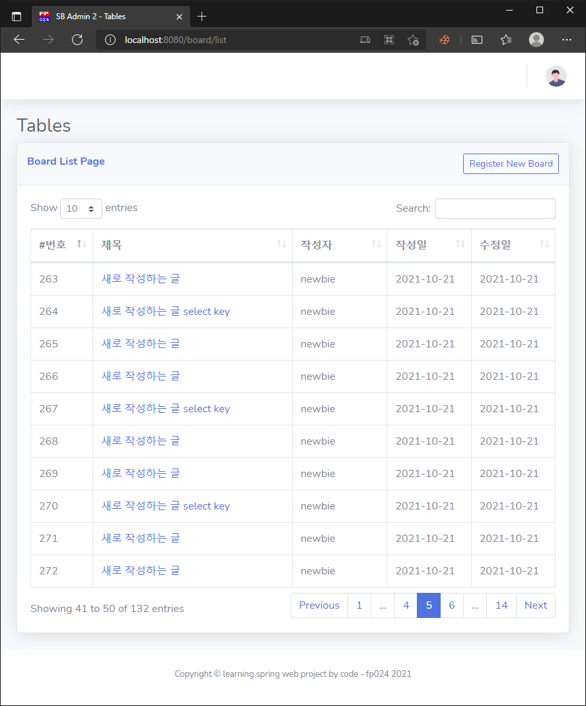

# Part 3. 기본적인 웹 게시물 관리

> **뷰 템플릿으로 SB Admin 2를 사용했습니다.**
>
> * https://github.com/StartBootstrap/startbootstrap-sb-admin-2

## 07. 스프링 MVC 프로젝트의 기본 구성

### 7.1 각 영역의 Naming Convention(명명 규칙)

* 이름 규칙
  * 컨트롤러
    * xxxController
  * 서비스
    * xxxService (인터페이스), xxxServiceImpl (구현 클래스)
  *  레파지토리
    * DAO (Data-Access-Object)
    * Repository
    * 이 책에서는 MyBatis Mapper 인터페이스로 사용함
  * 도메인
    * VO: Read Only 목적이 강함, 데이터 자체도 불편하게 설계하는 것이 정석
    * DTO: 데이터 수집의 용도가 강함
    * 이 책에서 테이블과 관련된 데이터는 VO란 이름을 사용함.

### 7.2 프로젝트를 위한 요구사항

* 게시판의 요구사항

  * 고객은 새로운 게시물을 등록할 수 있어야한다.
  * 고객은 특정한 게시물을 조회할 수 있어야한다.
  * 고객은 작성한 게시물을 삭제할 수 있어야한다.
  * ...

  

### 7.3 예제 프로젝트 구성

 *   프로젝트: ex02

     * Oracle 드라이버는 메이븐 레파지토리로 받을 수 있다.

       ```xml
       <dependency>
           <groupId>com.oracle.database.jdbc</groupId>
           <artifactId>ojdbc8</artifactId>
           <version>18.3.0.0</version>
       </dependency>
       ```

     * 그외 몇몇 라이브러리는 최신으로 수정. 

       * Java 11

       * Spring 5.2.17

       * Junit5 5.8.1

       * ...

         ```xml
         <properties>
             <java-version>11</java-version>
             <project.build.sourceEncoding>UTF-8</project.build.sourceEncoding>
             <maven.compiler.source>${java-version}</maven.compiler.source>
             <maven.compiler.target>${java-version}</maven.compiler.target>
             <org.springframework-version>5.2.17.RELEASE</org.springframework-version>
             <org.aspectj-version>1.9.7</org.aspectj-version>
             <org.slf4j-version>1.7.32</org.slf4j-version>
         </properties>
         ```

* 테이블 생성

  ```sql
  CREATE SEQUENCE seq_board;
  
  CREATE TABLE tbl_board (
      bno         NUMBER(10,0),
      title       VARCHAR2(200)   NOT NULL,
      content	    VARCHAR2(2000)  NOT NULL,
      writer      VARCHAR2(50)    NOT NULL,
      regdate     DATE            DEFAULT SYSDATE,
      updatedate  DATE            DEFAULT SYSDATE
  );
  
  ALTER TABLE tbl_board ADD CONSTRAINT pk_board
      PRIMARY KEY (bno);
  ```

* Dummy 데이터 생성

  ```sql
  INSERT INTO tbl_board (bno, title, content, writer)
    VALUES (seq_board.nextval, '테스트 제목', '테스트 내용', 'user00'); 
  ```

* book_ex 계정에 대해 권한은 줬는데, 공간할당을 정의해주지 않아서 INSERT시 오류가 발생했는데...

  * 나만 사용하는 테스트 DB여서 무제한으로 설정해주었다.
      ```sql
      ALTER USER book_ex DEFAULT TABLESPACE SPRING_TEST QUOTA UNLIMITED ON SPRING_TEST;
      -- 일단 무제한으로 주었다. 500M제한을 준다면 아래처럼 하자
      -- ALTER USER book_ex QUOTA 500M ON SPRING_TEST;
      ```
      


### 7.4 데이터베이스 관련 설정 및 테스트

* 이전과 마찬가지로 log4jdbc 설정없이 mapper 패키지 로깅방식으로 쿼리 로그를 출력하게 했다. test resource의 log4j.xml 참고

* JUnit 5로 설정한 테스트 케이스를 돌리려면  maven-surefire-plugin 을 버전업 해두자!

  ```xml
  <pluginManagement>
      <plugins>
          <!-- JUnit 5 사용을 위해서 maven-surefire-plugin 버전을 올려두자! -->
          <plugin>
              <artifactId>maven-surefire-plugin</artifactId>
              <version>2.22.2</version>
          </plugin>
          ...
  ```

* mvnw 로 명령 프롬프트에서 실행하면 경고가 남는 부분이 있다. IDE에서도 남던 경고인데, 그동안 신경을 안써서 몰랐다.

  ```
  [WARNING] [path] bad path element "C:\Users\사용자_이름\.m2\repository\com\oracle\database\jdbc\ojdbc8\18.3.0.0\oraclepki.jar": no such file or directory
  [WARNING] [path] bad path element "C:\Users\사용자_이름\.m2\repository\com\oracle\database\security\oraclepki\18.3.0.0\osdt_core.jar": no such file or directory
  [WARNING] [path] bad path element "C:\Users\사용자_이름\.m2\repository\com\oracle\database\security\oraclepki\18.3.0.0\osdt_cert.jar": no such file or directory
  [WARNING] [path] bad path element "C:\Users\사용자_이름\.m2\repository\com\oracle\database\security\oraclepki\oracle.osdt\osdt_core.jar": no such file or directory
  [WARNING] [path] bad path element "C:\Users\사용자_이름\.m2\repository\com\oracle\database\security\oraclepki\oracle.osdt\osdt_cert.jar": no such file or directory
  [WARNING] No processor claimed any of these annotations: /org.junit.jupiter.api.Test,/org.junit.jupiter.api.extension.ExtendWith,/org.springframework.test.context.ContextConfiguration,/org.springframework.beans.factory.annotation.Autowired
  ```

  * 위에 파일 없다는 것은 실제로 없긴한데, 디펜던시 트리상으로 다른 경로에 정상적으로 설정이 되어있음. Oracle 쿼리 동작에도 문제가 없는 상태인데... 뭔가 이상하긴 하지만 무시해도 될 경고 같다.

  * No processor claimed any of these annotations 는 어노테이션을 요구한 프로세서가 없다는데, 실제로 mvnw에서 test 골이 잘 동작하고, Spring 도 정상적으로 동작했다. 이것도 무시해도 될 것 같다.

    ```xml
    <!--
    	명시적으로 compilerArgs 나, showWarnings를 설정하지 않으면 경고가 안보여서 그동안 잘 몰랐던 것 같다.
        이 프로젝트의 경우는 아래 설정이 있어서 경고가 노출되었다.
    -->
    
    <plugin>
        <groupId>org.apache.maven.plugins</groupId>
        <artifactId>maven-compiler-plugin</artifactId>
        <version>3.8.1</version>
        <configuration>
            <source>${java-version}</source>
            <target>${java-version}</target>
            <compilerArgs>
                <arg>-Xlint:all</arg>
                <arg>-Xlint:-processing</arg>  <!-- No processor claimed any of these annotations 경고는 노출되지않게 설정 -->
            </compilerArgs>
            <showWarnings>true</showWarnings>  <!-- 오라클 드라이버관련 경고관련해서는 이걸 false로 하면 될태지만, 냅두자 -->
            <showDeprecation>true</showDeprecation>
        </configuration>
    </plugin>
    ```

  * Spring Legacy 프로젝트 생성시 자동 추가된 jcl-over-slf4j 는 제거 했다. spring-jcl-5.2.17.RELEASE 에 같은 패키지로 포함이 되어있다.

    ```xml
    <!-- // spring-jcl-5.2.17.RELEASE 에 같은 패키지로 포함이 되어있다.
    <dependency>
        <groupId>org.slf4j</groupId>
        <artifactId>jcl-over-slf4j</artifactId>
        <version>${org.slf4j-version}</version>
        <scope>runtime</scope>
    </dependency>
    -->	
    ```

    


### 7.5 Java 설정을 이용하는 경우의 프로젝트 구성

* jex02 프로젝트 생성

* mvnw 추가

  `mvn -N io.takari:maven:wrapper -Dmaven=3.8.2`

* Maven tool chain 설정 적용

  * 명령프롬프트 환경에서 Java 8 환경에서 Maven 을 사용해서 프로젝트 설정이 Java 11로 되어있는 프로젝트 빌드를 할 수 없다. 
  * 아래 tool chain 설정을 적용뒤에, Java 8 환경의 명령 프롬프트에서 Java 11을 찾아 정상 빌드함을 확인했다.
    * https://maven.apache.org/guides/mini/guide-using-toolchains.html

* **jetty-maven-plugin**을 사용할 때, tool chain을 쓰더라도, 빌드는 JDK 11로 하지만  Jetty는 toolchain 설정으로 처리되지 않고,  Maven을 구동하는 JDK 버전으로 동작하기 때문에, JDK버전을 맞춰줄 수 밖에 없다.

  * Maven을 구동하는 버전이 JDK 8이고, toolchain으로 설정한 JDK 버전이 11이면, toolchain에 의해 11버전으로 빌드된 Java 클래스파일을 Jetty가 처리할 수 없어 오류가 난다. (Unsupported major.minor version XX.X)


## 08. 영속/비즈니스 계층의 CRUD 구현
* 영속 계층의 작업 순서
  1. 테이블 컬럼 구조를 반영하는 VO(Value Object) 클래스의 생성
  2. MyBatis의 Mapper 인터페이스의 작성/XML 처리
  3. 작성한 Mapper 인터페이스 테스트

### 8.1 영속 계층의 구현 준비

### 8.2 영속 영역의 CRUD 구현

ex02 프로젝트는 책의 설명 그대로 따라가고 jex02 프로젝트는 `MyBatis Dynamic SQL` 모듈을 사용해서 매퍼를 자동으로 만들고, QueryDSL 처럼 메서드를 연이어 호출해가며 실행하는 방식으로 해봤다.

* https://mybatis.org/mybatis-dynamic-sql/docs/introduction.html
* jex02에서 주목해야할 코드들..
  * generatorConfig.xml
  * BoardMapper
  * BoardVODynamicSqlSupport
  * BoardMapperTest
  * BoardVO (DB 테이블명과 generatorConfig.xml에 오버라이드 설정 참고해서 POJO 클래스를 만들어준다. 주석이 많긴한데, lombok으로 줄여서 써도 된다.)

## 09. 비즈니스 계층

### 9.1 비즈니스 계층의 설정

### 9.2 비즈니스 계층의 구현과 테스트

* jex02의경우 MyBatis Dynamic SQL 라이브러리로 진행하고 ex02는 책내용대로 진행

  * https://mybatis.org/mybatis-dynamic-sql/docs/delete.html
  * 특별한 문제가 없는한 jexXX 프로젝트는 이 라이브러리 기반으로 구현할 것 같다.

* google-java-format을 적용했다.

  * 탭사이즈는 공백 2


## 10. 프리젠테이션(웹) 계층의 CRUD 구현

### 10.1 Controller의 작성

* 기능 호출 테이블

  |   Task    |       URL       | Method | Parameter | Form          | URL 이동 |
  | :-------: | :-------------: | :----: | :-------: | ------------- | :------: |
  | 전체 목록 |   /board/list   |  GET   |           |               |          |
  | 등록처리  | /board/register |  POST  | 모든 항목 | 입력화면 필요 |   이동   |
  |   조회    |   /board/read   |  GET   |  bno=123  |               |          |
  | 삭제 처리 |  /board/remove  |  POST  |    bno    | 입력화면 필요 |   이동   |
  | 수정 처리 |  /board/modify  |  POST  | 모든 항목 | 입력화면 필요 |   이동   |


### 10.2 BoardController의 작성

* Spring 5에서는 @SpringJUnitWebConfig 에 @ExtendWith(SpringExtension.class), @WebAppConfiguration, @ContextConfiguration 을 포함함.

  * https://www.baeldung.com/spring-5-junit-config

* 하나의 컨트롤러를 테스트 할때는 아래와 같은 방식이 더 낫다고 하여 적용해봄.

  ```java
  @Autowired private BoardService service;
  ...
  @BeforeEach
  void setUp() {
      // this.mockMvc = MockMvcBuilders.webAppContextSetup(ctx).build();
      this.mockMvc = MockMvcBuilders.standaloneSetup(new BoardController(service)).build();
  }
  ...
  ```


## 11. 화면 처리

* SB Admin 2

  * https://github.com/StartBootstrap/startbootstrap-sb-admin-2

  * 깃허브에서 체크아웃 후에 `v4.1.4` 태그 버전 브랜치 생성

    ```bash
    git clonehttps://github.com/StartBootstrap/startbootstrap-sb-admin-2.git
    cd startbootstrap-sb-admin-2
    git checkout tags/v4.1.4 -b v4.1.4
    ```

  * package-lock.json을 보았을 때, 부트스트랩버전은 `4.6.0` 이다.

### 11.1 목록 페이지 작업과 includes

* jQuery는 그대로 사용, 포함된 버전이  `3.6.0` 버전인데, 책의 버전인 `3.3.1`보다 최신이여서, 일부러 버전을 올릴필요가 없음.

* p235의 반응형 문제를 해결하기 위한 추가 코드를 입력할 필요없음.


### 11.2 목록 화면 처리

* LocalDateTime 을 JSP에서 사용하기 위해.. 라이브러리 추가
  * https://github.com/sargue/java-time-jsptags

  * 사용법

      ```jsp
      <%@ taglib prefix="javatime" uri="http://sargue.net/jsptags/time" %>
      ...
      <td><javatime:format value="${board.regdate}" pattern="yyyy-MM-dd"></javatime:format></td>
      <td><javatime:format value="${board.updateDate}" pattern="yyyy-MM-dd"></javatime:format></td>
      ```


### 11.3 등록 입력 페이지와 등록 처리

* 테이블 div기준으로 본문 내용만 등록페이지에 맞게 변경 : register.jsp
* 버튼은 아래 페이지에서 모양 보고 클래스 값 바꿔서 확인하자
  * https://getbootstrap.com/docs/4.0/components/buttons/

* 한글입력처리는 이전 1장에서 소개된대로, web.xml 설정 또는  WebConfig 설정에서 UTF-8 설정을 진행했다.

### 11.4 조회 페이지와 이동

* 뒤로 가기 문제..

* Firefox,에서는 재현되지 않음

  * `등록` > `모달창` > `목록 페이지` > `조회 페이지` 까지 간 후 뒤로가기 할 때, 모달창이 다시 뜨진 않음. 

* **그러나 Chrome, Edge, IE 11에서는 재현됨**...

* history.replaceState 와 history.state의 설정 상태로 개선할 수 있음.

  ```javascript
  ...
  history.replaceState({}, null, null);
  if (history.state) {
  	return;
  }
  ```

  * https://developer.mozilla.org/ko/docs/Web/API/History/state
  * https://developer.mozilla.org/ko/docs/Web/API/History/replaceState

### 11.5 게시물의 수정/삭제 처리

* **TODO:** ~p260 코드가 좀 이상한 것 같다. 등록일시, 수정일시를 수정 폼에서 받아 왜? 다시 서버로 처리되게 하는지?

  * 등록일시가 SYSDATE로 자동처리되고 있고, 수정일시도 서버에서 UPDATE할 때 SYSDATE로 처리하는데, 왜이렇게 하셨을까? 
  * 이부분은 추가하지 말고 추후 필요시 추가하자..

* `jquery.min.js` 라이브러리는 `bootstap.bundle.min.js` 보다 위에 있어야한다.

* 스크립트를 전부 footer 아래의 dialogAndScript.jsp로 다 내려서 현시점에 문제가 없는 상태여서, `jquery.min.js`도 헤더에 두지 않고 footer이하에 두었다.

  

## 12. 오라클 데이터베이스 페이징 처리

### 12.1 order by의 문제

### 12.2 order by 보다는 인덱스

### 12.3 인덱스를 이용하는 정렬

### 12.3 ROWNUM과 인라인뷰


## 13. MyBatis와 스프링에서 페이징 처리

### 13.1 MyBatis 처리와 테스트 

### 13.2 BoardController와 BoardService 수정


## 14. 페이징 화면 처리

### 14.1 페이징 처리할 때 필요한 정보들

### 14.2 페이징 처리를 위한 클래스 설계

### 14.3 JSP에서 페이지 번호 출력

### 14.4 조회 페이지로 이동

### 14.5 수정과 삭제 처리

### 14.6 MyBatis에서 전체 데이터의 개수 처리


## 15.  검색처리

### 15.1 검색 기능과 SQL

### 15.2 MyBatis의 동적 SQL

### 15.3 검색 조건 처리를 위한 Criteria의 변화

### 15.4 화면에서 검색 조건 처리


---

## 기타

### web.xml의 xml검증 오류: cvc-id.3: A field of identity constraint 'web-common-servlet-name-uniqueness' matched element 'web-app', but this element does not have a simple type.

```xml
<!-- <web-app version="2.5" xmlns="http://java.sun.com/xml/ns/javaee"
	xmlns:xsi="http://www.w3.org/2001/XMLSchema-instance"
	xsi:schemaLocation="http://java.sun.com/xml/ns/javaee https://java.sun.com/xml/ns/javaee/web-app_2_5.xsd"
	>  -->
 <!--
 	생성된 web.xml의 코드로 검증오류가 발생해서...
 	
 	cvc-id.3: A field of identity constraint 'web-common-servlet-name-uniqueness' matched element 'web-app', but this element does not have a simple type.
  
	https://stackoverflow.com/questions/3219639/cvc-id-3-error-in-web-xml
	배포 기술자의 버전 및 형식을 다른 버전들로 바꿔봤다.	
 -->
<web-app    xmlns="http://xmlns.jcp.org/xml/ns/javaee"
             xmlns:xsi="http://www.w3.org/2001/XMLSchema-instance"
             xsi:schemaLocation="http://xmlns.jcp.org/xml/ns/javaee
                                 http://xmlns.jcp.org/xml/ns/javaee/web-app_3_1.xsd"
    version="3.1">
 
```

그동안의 답변이 스키마의 주소를 바꿔주는 방법으로 오류를 회피했던 답변들이 많았는데, 이렇게 하는게 그거보단 나은 것 같다.  

  * 참고
    * [Tomcat 6, 7, 8, 9, 10 의 예제 페이지의 web.xml 스키마 헤더 선언부](https://github.com/fp024/etc/blob/main/tomcat/Tomcat_6%EC%97%90%EC%84%9C_10%EA%B9%8C%EC%A7%80%EC%9D%98_%EC%98%88%EC%A0%9C_web.xml_%EC%8A%A4%ED%82%A4%EB%A7%88_%ED%97%A4%EB%8D%94.md)


---

## Jetty의 Scan을 통한 재시작시 문제

Jetty에서 타겟 리소스 변경(소스코드 변경등..)시 자동 재배포 하는 기능(`<scan>`)을 사용해서 재시작 하면 ContextLoaderListener 관련해서 재대로 실행이 안되는지, 컨텍스트가 제대로 로딩되지 않은 상태 처럼 되어서, 컨트롤러에 접근할 수 없었다.

그런데, Eclipse 내에서 Tomcat 8.5의 `Automatically  publish after a build event` 또는 `Automatically publish when resources change` 설정을 통해서 자동재시작을 설정했을 때는 문제가 없었다.

일단은 Jetty 메이븐 플러그인 설정에서 `<scan>` 기능을 사용하지 않도록 하자! 

그런데 아무리 Jetty가 변경감지 자동재시작이 안된다하더라도 eclipse에서 문제 발생시 이것저것 clean후 실행하는 것으로 시간이 소비될떈, Jetty 사용하는게 나을 수 있을 것 같다.


### 문제 상세

#### 1. web.xml 설정 기반 프로젝트에서 jetty-maven-plugin의  webapp 변경시 자동 재시작을 시켜주는 `<scan>` 기능을 사용하여, 자동재시작시 ContextLoaderListener를 로드 할 수 없는 문제

* webapps에 변경을 감지하고 Jetty가 재시작 될 때, ContextLoaderListener 를 로드하지 않는 문제가 있다. 
    ```
    [WARNING] Unable to load class org.springframework.web.context.ContextLoaderListener
    java.lang.ClassNotFoundException: org.springframework.web.context.ContextLoaderListener
        at org.codehaus.plexus.classworlds.strategy.SelfFirstStrategy.loadClass (SelfFirstStrategy.java:50)
        ...
    [WARNING] Failed startup of context o.e.j.m.p.MavenWebAppContext@36ef1d65{/프로젝트_이름,[file:///C:/프로젝트_베이스_경로/src/main/webapp/],UNAVAILABLE}{file:///C:/프로젝트_베이스_경로/src/main/webapp/}
    javax.servlet.UnavailableException: Class loading error for holder org.springframework.web.context.ContextLoaderListener@4b3c01ee{src=DESCRIPTOR:file:///C:/프로젝트_베이스_경로/src/main/webapp/WEB-INF/web.xml}
        at org.eclipse.jetty.servlet.BaseHolder.doStart (BaseHolder.java:104)
        ...
    ```

    * Jetty로 최초 시작시는 문제가 없는데, 자동 재시작 설정에의해 재시작 될 때는 위의 문제가 발생함.

    * BaseHolder.doStart() 에서는 ContextLoaderListener를 그냥 클래스 로드만 한 것 같은데...

      * https://github.com/eclipse/jetty.project/blob/jetty-10.0.x/jetty-servlet/src/main/java/org/eclipse/jetty/servlet/BaseHolder.java

        ```java
         //try to load class
        if (_class == null)
        {
            try
            {
                _class = Loader.loadClass(_className);
                if (LOG.isDebugEnabled())
                    LOG.debug("Holding {} from {}", _class, _class.getClassLoader());
            }
            catch (Exception e)
            {
                LOG.warn("Unable to load class {}", _className, e);
                throw new UnavailableException("Class loading error for holder " + toString());
            }
        }
        ```

      * Loader.loadClass(String name)

        * https://github.com/eclipse/jetty.project/blob/jetty-10.0.x/jetty-util/src/main/java/org/eclipse/jetty/util/Loader.java

          ```java
           @SuppressWarnings("rawtypes")
          public static Class loadClass(String name)
              throws ClassNotFoundException
          {
              ClassLoader loader = Thread.currentThread().getContextClassLoader();
              return (loader == null) ? Class.forName(name) : loader.loadClass(name);
          }
          ```

    * 당장 문제를 해결할 수 없으니  web.xml 기반 프로젝트에는 `<scan>-1</scan>` 으로 설정해서 자동 재시작이 되지 않도록하자! 

    

#### 2. JavaConfig 설정 기반 프로젝트에서 jetty-maven-plugin의  webapp 변경시 자동 재시작을 시켜주는 `<scan>` 기능을 사용하여, 자동재시작시 ContextLoaderListener를 로드는 되는 것 처럼 보이나 실제로 제대로 실행안되는 문제.

* log4j 관련 오류가 발생하는데...

    ```
    org.springframework.web.context.support.AnnotationConfigWebApplicationContext - Exception encountered during context initialization - cancelling refresh attempt: org.springframework.beans.factory.BeanDefinitionStoreException: Failed to parse configuration class [org.fp024.config.RootConfig]; nested exception is java.lang.NoClassDefFoundError: org/apache/logging/log4j/core/impl/ThrowableProxy
    ```

* 아래 라이브러리를  추가하면, 로그상으로는 재시작이 성공한 것 처럼 보이지만., 제대로 재시작되지 않은 상태이다.

    ```xml
    <!-- https://stackoverflow.com/questions/21935447/log4j2-xml-configuration-in-web-xml-illegalargumentexception-uri-is-not-absol -->
        <dependency>
            <groupId>org.apache.logging.log4j</groupId>
            <artifactId>log4j-web</artifactId>
        </dependency>
    ```
    
    * Java Config 프로젝트도 web.xml 설정 프로젝트와 마찬가지로 `<scan>-1</scan>` 으로 설정해두고 mvnw 명령으로 처음부터 재시작 하는게 나아보인다.

---

## SB Admin 2 템플릿을 붙이고나서 프로젝트사이즈가 대폭 늘어서 정리...

* 프로젝트에서는 테이블(table.html) 관련만 쓰는데, 다른 것들이 너무 많은 용량을 차지해서 (`19MB`) 테이블과 우상단 로그인 네비게이션만 빼고 정리했다.

* 정리후 `900KB`정도로 줄었다.

  * 코드 참조가 필요할 경우 https://github.com/StartBootstrap/startbootstrap-sb-admin-2  의 `v4.1.4` 테그를 확인하자!
  
  

