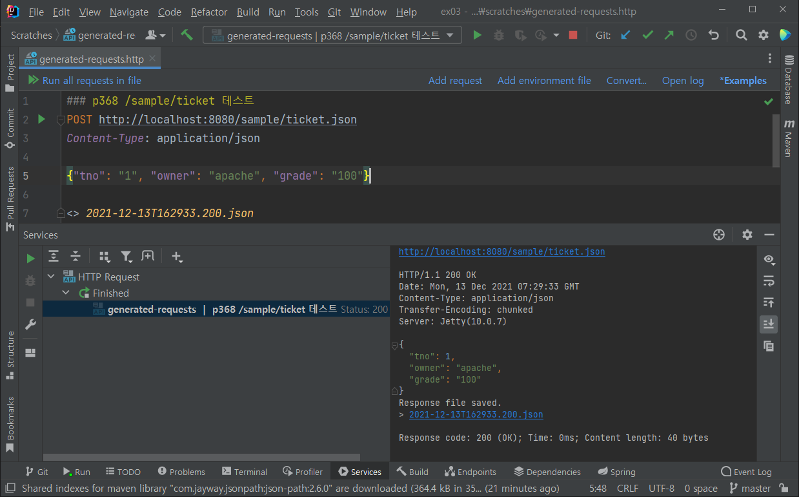

# Part 4. REST 방식과 Ajax를 이용하는 댓글 처리


## 16. REST 방식으로 전환

* 모바일 시대가 되면서 서버의 역활이 변화됨
  * 기존 브라우저 대상을 위해 HTML형태로 전달을 해왔다면, 이제는 순수한 데이터를 전달하는 형태로 변화됨 (API 서버)
* URI (Uniform Resource Identifier)
  * 이전에는 페이지를 이동하더라도 브라우저의 주소는 변화하지 않는 방식을 선호했음
  * 현재의 대부분은 페이지를 이동하면 브라우저의 주소도 같이 이동하는 방식을 사용함

* URL와 URI(자원의 식별자)의 상징적인 의미
  * URL : 이 곳에 가면 당신이 원하는 것을 찾을 수 있습니다.
  * URI: 당신이 원하는 곳의 주소는 여기입니다.
    * URI의 I는 DB의 PK와 같은 의미로 생각할 수 있음.


##### REST는...

* URI는 하나의 고유한 리소스(Resource)를 대표하도록 설계된다는 개념에 전송방식을 결합해서 원하는 작업을 지정함.

* REST 방식의 구성
  * `URI` + `GET/POST/PUT/DELETE/...`


##### Spring에서 제공하는 REST 관련 어노테이션

| 어노테이션      | 기능                                                         |
| --------------- | ------------------------------------------------------------ |
| @RestController | Controller가 REST 방식을 처리위한 것임을 명시합니다.         |
| @ResponseBody   | 일반적인 JSP와 같은 뷰로 전달된는 것이 아니라 데이터 자체를 전달하기 위한 용도 |
| @PathVariable   | URL 경로에 있는 값을 파라미터로 추출하려고 할 때 사용        |
| @CrossOrigin    | Ajax의 크로스 도메인 문제를 해결해주는 어노테이션            |
| @RequestBody    | JSON 데이터를 원하는 타입으로 바인딩 처리                    |


### 16.1 @RestController

* 서버에서 존송하는 것이 순수한 데이터이므로, 모든 메서드의 리턴타입을 기존과 다르게 처리함을 명시해야 함.
  * 스프링 4부터는 @RestController를 붙일 수 있음.
  * 이전 버전에서는 클래스 또는 메서드 위에 @ResponseBody를 붙여줬었음.

##### 16.1.1 예제 프로젝트 준비

* ex03 프로젝트
  * jackson 을 사용한다.
  * 테스트 환경에서 gson을 사용하는 부분이 있다고 하여, 추가했다.
* jex03 프로젝트
  * gson을 사용해보자!


### 16.2 @RestController의 반환타입

* SampleController 클래스 확인 주소
  * `http://localhost:8080/sample/getText`

##### 16.2.1 단순문자열 반환

* @GetMapping에 사용된 produces 속성은 해당 메서드가 생산하는 MIME 타입을 의미함.

##### 16.2.2 객체의 반환

* MediaType.APPLICATION_JSON_UTF8_VALUE 를 사용할  때 Deprecated 경고

  * 현시점에서 크롬과 같은 주요 브라우저들이 charset=UTF-8 파라미터 없이 UTF-8 특수 문자들을 올바르게 해석하므로, 스프링 5.2부터 APPLICATION_JSON_VALUE를 선호한다고 함.

      ```
      A String equivalent of APPLICATION_JSON_UTF8.
      Deprecated
      as of 5.2 in favor of APPLICATION_JSON_VALUE since major browsers like Chrome now comply with the specification  and interpret correctly UTF-8 special characters without requiring a charset=UTF-8 parameter.
      ```

      * 
      * 괜히 Deprecated 경고 나오니, APPLICATION_JSON_VALUE 으로 사용하자!

* getSample 테스트주소

  * 브라우저에서 다음과 요청할 떄 `http://localhost:8080/sample/getSample`  
    * XML로 결과를 받음
    * `http://localhost:8080/sample/getSample.xml` 도 동일하게 xml로 결과를 받음

  * 그런데 끝에 json 확장자를 붙이면 json 결과를 받음
    * `http://localhost:8080/sample/getSample.json`  


##### 16.2.3 컬렉션 타입의 객체 반환

* List

  * SampleController의 getList() 메서드 참조

* Map

  * SampleController의 getMap() 메서드 참조

    * json

      ```json
      {"First":{"mno":111,"firstName":"그루트","lastName":"주니어"}}
      ```
    * xml
      ```xml
      <Map>
        <First>
          <mno>111</mno>
          <firstName>그루트</firstName>
          <lastName>주니어</lastName>
        </First>
      </Map>
      ```
    

##### 16.2.4 ResponseEntity 타입

* 데이터를 요청한 쪽에서 서버로 부터 받은 메시지가 정상적인 데이터인지 알 수 있는 수단이 필요함
* ResponseEntity는 데이터와 함께 HTTP 헤더의 상태 메시지등을 같이 전달하는 용도로 사용함.
* SampleController 의 check() 메서드 참조

* 기타 내용
  * String.valueOf() 입력으로 null을 주면 결과는 "null" 문자열을 반환함. NPE가 발생되지 않음
  * @GetMapping의 params와 관련된 내용
    * height, height 파라미터 전달이 모두 포함되지 않으면 400 상태코드로 에러 반환


### 16.3 @RestController에서 파라미터

* `@PathVariable`: 일반 컨트롤러에서도 사용이 가능하지만, REST 방식에서 자주사용됨, URL 경로 일부를 파라미터로 사용할 때 이용
* `@RequestBody`: JSON 데이터를 원하는 타입의 객체로 변환해야 하는 경우에 주로 사용.


##### 16.3.1 @PathVariable

* REST 방식에서는 URL 자체에 데이터를 식별할 수 있는 정보들을 펴현하는 경우가 많아 다양한 방식으로 `@PathVariable`이 사용됨.
* SampleController의 getPath() 메서드 참조

* xml 결과
  * `http://localhost:8080/sample/product/bags/1234`
  * `http://localhost:8080/sample/product/bags/1234.xml`
* json 결과
  * `http://localhost:8080/sample/product/bags/1234.json`


##### 16.3.2 @RequestBody

* `@RequestBody`는 전달된 요청(request)의 내용(body)를 이용해서 해당 파라미터의 타입으로 변환을 요구함.

* 대부분의 경우 JSON 데이터를 서버에 보내서 원하는 타입의 객체로 변환하는 용도로 사용됨.

* SampleController의 ticket() 메서드 참조

* IntelliJ 에서 직접 POST 요청을 보내 테스트 해볼 수 있다.

  ```bash
  ### p368 /sample/ticket 테스트
  POST http://localhost:8080/sample/ticket.json
  Content-Type: application/json
  
  {"tno": "1", "owner": "apache", "grade": "100"}
  ```

  

  

  

### 16.4 REST 방식의 테스트

##### 16.4.1 JUnit 기반의 테스트

* 책에서 사용한 Gson 사용처를 보니 단순하게 객체를 String으로 변환하는 것 뿐이여서, Gson의 디펜던시를 제거하고 Jackson의 ObjectMapper의 writeValueAsString() 메서드를 사용하는 방식으로 변경했다.
    * ObjectMapper 유틸리티 클래스를 싱글톤의 Lazy초기화 방식을 사용했다.
      * https://sabarada.tistory.com/128

* `org.hamcrest.Matcher not found` 메시지가 떠서, `hamcrest` 라이브러리도 디펜던시에 추가했다.
  * https://mvnrepository.com/artifact/org.hamcrest/hamcrest
  * 그외에 `mockito-junit-jupiter`, `mockito-inline` 도 미리 추가해둠.

* JSON Path
  * SampleControllerTest 클래스에 JSON Path 를 통한 검증을 추가했다.
  * https://github.com/json-path/JsonPath


##### 16.4.2 기타 도구

* curl, 크롬 확장 프로그램중 REST Client 등등...


### 16.5 다양한 전송방식

* HTTP 전송방식

  | 작업   | 전송방식 |
  | ------ | -------- |
  | Create | POST     |
  | Read   | GET      |
  | Update | PUT      |
  | Delete | DELETE   |

  

* 회원이라는 자원을 대상으로 결합한다면 아래 예를 생각해볼 수 있다.

  | 작업 | 전송방식 | URI                                   |
  | ---- | -------- | ------------------------------------- |
  | 등록 | POST     | /members/new                          |
  | 조회 | GET      | /members/{id}                         |
  | 수정 | PUT      | /members/{id} + body {json 데이터 등} |
  | 삭제 | DELETE   | /member/{id}                          |

  


---

## 17. Ajax 댓글 처리


### 17.1 프로젝트의 구성

REST 예제를 붙여넣었던 ex03에 그대로 진행을 먼저하고, jex03에도 mybatis-dynamic-sql 에 맞게변경해서 진행하면 되겠다.


### 17.2 댓글 처리를 위한 영속 영역

* 댓글 처리를 위한 테이블 생성과 처리

  ```sql
  CREATE TABLE tbl_reply (
      rno         NUMBER(10,0),
      bno         NUMBER(10,0)        NOT NULL,
      reply       VARCHAR2(1000)      NOT NULL,
      replyer     VARCHAR2(50)        NOT NULL,
      replyDate   DATE                DEFAULT SYSDATE,
      updateDate  DATE                DEFAULT SYSDATE
  );
  
  CREATE SEQUENCE seq_reply;
  
  ALTER TABLE tbl_reply ADD CONSTRAINT pk_reply PRIMARY KEY (rno);
  
  ALTER TABLE tbl_reply ADD CONSTRAINT fk_reply_board
    FOREIGN KEY (bno) REFERENCES tbl_board (bno);
  ```

* 최신 게시글 몇개를 보고 싶을 때

  ```sql
  SELECT * FROM tbl_board WHERE rownum < 10 ORDER BY bno DESC;
  ```

  책에 위와 같이 나왔는데, 잘못 적으신 것 같다. ORDER BY 보다 rownum < 10 이 먼저 실행되어 원하는 내용이 안나온다.

  ```sql
  SELECT  /*+ INDEX_DESC(tbl_board pk_board) */ * FROM tbl_board WHERE rownum < 10;
  
  -- 위 또는 아래 처럼 쿼리 해야한다.
  
  SELECT * FROM (
     SELECT * 
       FROM tbl_board
      ORDER BY bno DESC
  ) WHERE rownum < 10;
  ```

  | BNO      | TITLE                       | CONTENT                       | WRITER  | REGDATE             | UPDATEDATE          |
  | :------- | :-------------------------- | :---------------------------- | :------ | :------------------ | :------------------ |
  | 10000487 | 1새로 작성하는 글           | 새로 작성하는 내용            | newbie  | 2021-12-30 00:52:26 | 2021-12-30 00:52:26 |
  | 10000486 | 새로 작성하는 글 select key | 새로 작성하는 내용 select key | newbie  | 2021-12-30 00:52:23 | 2021-12-30 00:52:23 |
  | 10000485 | 테스트 새글 제목            | 테스트 새글 내용              | useer00 | 2021-12-30 00:52:23 | 2021-12-30 00:52:23 |
  | 10000484 | 새로 작성하는 글            | 새로 작성하는 내용            | newbie  | 2021-12-30 00:51:49 | 2021-12-30 00:51:49 |
  | 10000483 | 새로 작성하는 글            | 새로 작성하는 내용            | newbie  | 2021-12-30 00:51:48 | 2021-12-30 00:51:48 |
  | 10000482 | 새로 작성하는 글 select key | 새로 작성하는 내용 select key | newbie  | 2021-12-30 00:51:45 | 2021-12-30 00:51:45 |
  | 10000481 | 테스트 새글 제목            | 테스트 새글 내용              | useer00 | 2021-12-30 00:51:45 | 2021-12-30 00:51:45 |
  | 10000470 | 새로 작성하는 글            | 새로 작성하는 내용            | newbie  | 2021-12-27 15:02:27 | 2021-12-27 15:02:27 |
  | 10000469 | 새로 작성하는 글            | 새로 작성하는 내용            | newbie  | 2021-12-27 15:02:26 | 2021-12-27 15:02:26 |

* IntelliJ가 MyBatis로서 처리되는 Mapper 빈을 인식을 못하는 것 같다.

  ```java
  // 테스트 코드의 필드로 mapper를 정의하고 @Autowired로 받을 때, 아래 오류 노출.
  // Could not autowire. No beans of 'ReplyMapper' type found. 
  @Autowired private ReplyMapper mapper;
  // 테스트 실행에는 문제가 없다.
  ```

  


### 17.3 서비스 영역과 Controller 처리

* 리플의 insert의 리턴을 int로 받는 부분이 있어서 이후 코드를 보았을 때, 업데이트 카운트로 처리하고 있었다.

  그러면 XML매퍼에서 `<update>`로 해야했던 것 같은데.. 진행하면서 확인해보자!


##### 17.3.1 ReplyController의 설계

| 작업   | URL                           | HTTP 전송방식 |
| ------ | ----------------------------- | ------------- |
| 등록   | /replies/new                  | POST          |
| 조회   | /replies/${rno}               | GET           |
| 삭제   | /replies/${rno}               | DELETE        |
| 수정   | /replies/${rno}               | PUT or PATCH  |
| 페이지 | /replies/pages/${bno}/${page} | GET           |


##### 17.3.2 등록 작업과 테스트

* 등록/수정 등의 테스트는 @SpringJUnitWebConfig, MockMvc로 테스트를 하자!


* LocalDateTime을 JSON 스트링으로 변환할 일이 있을 때, jackson을 쓴다면 아래 라이브러리가 디펜던시되야한다.

  ```xml
  <!--
    Java 8 date/time 처리를 위해서는 아래 모듈 추가 후 등록해야한다.
    JacksonJSONWriter 클래스 참조
  -->
  <dependency>
      <groupId>com.fasterxml.jackson.datatype</groupId>
      <artifactId>jackson-datatype-jsr310</artifactId>
      <version>${jackson.version}</version>
  </dependency>
  ```

  

* content-type으로 인코딩을 설정하는 것들이 Deprecated 되고 있어서, MVC 테스트를 할 때, 강제 UTF-8 필터를 미리 설정해줘야 한글이 안깨진다.

  ```java
    @BeforeEach
    void setUp() {
      this.mockMvc =
          MockMvcBuilders.standaloneSetup(new ReplyController(service))
              .addFilter(new CharacterEncodingFilter(StandardCharsets.UTF_8.name(), true))
              .build();
    }
  ```

* JSON String으로 LocalDateTime 값을 서버로 부터 받을 때 날짜형식이 좀 특이한데, 다음 챕터 할 때 고려해야겠다.

  ```json
  {"rno":6,"bno":10000487,"reply":"댓글 테스트 6","replyer":"replayer6","replyDate":[2021,12,31,1,46,27],"updateDate":[2021,12,31,1,46,27]}
  ```

  그냥 Date를 썼으면 타임스템프 숫자가 반환되긴할 텐데...

  ```java
    @JsonFormat(shape = JsonFormat.Shape.STRING, pattern = "yyyy-MM-dd hh:mm:ss")
    private LocalDateTime replyDate;
  ```

  ReplyVO 도메인에 날짜 필드에 위와 같이 붙이고 이 기준으로 다음 챕터에서 적용해보자!

  * https://github.com/FasterXML/jackson-modules-java8/tree/master/datetime


### 17.4 JavaScript 준비


### 17.5 이벤트 처리와 HTML 처리


### 17.6 댓글의 페이징 처리


### 17.7 댓글 페이지의 화면 처리


---

## 기타
