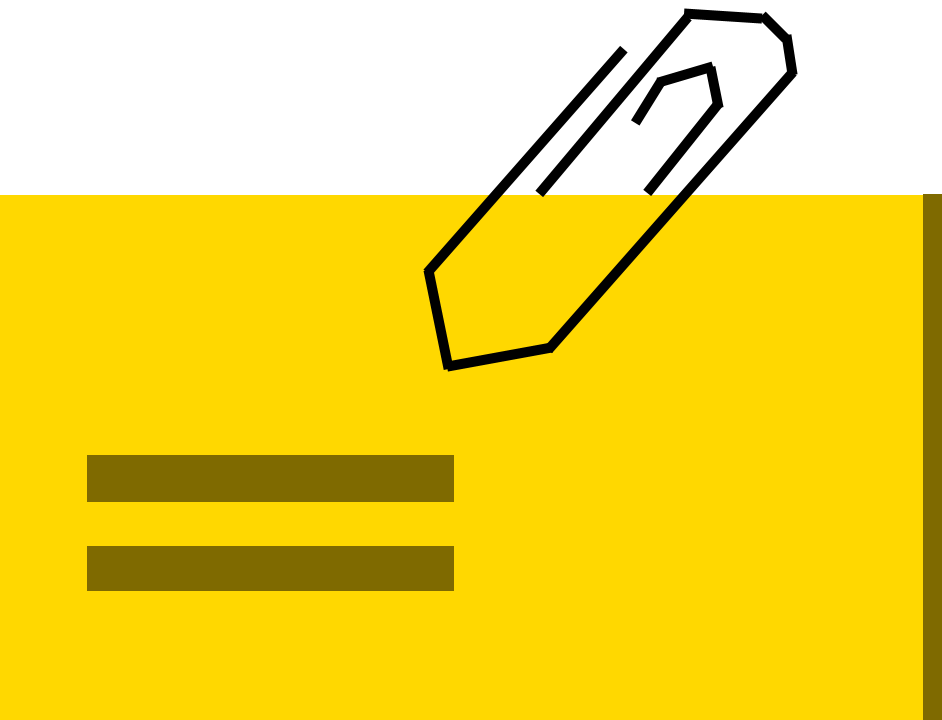

# Part 6. 파일 업로드 처리

기억해보면 특별히 파일업로드를 전문적으로 할일이 없었던 것 같긴하다. 해본 것은 엑셀파일업로드 / 다운로드 그리고 빌드 결과물 업로드 정도인데, 거의 존재하는 시스템을 수정하거나 간단한 것을 새로만든 정도라서, 이 Part를 잘 봐보자!


## 21. 파일 업로드 방식

* `<form>`태그를 이용하는 방식
  * 브라우저 제한이 없어야하는 경우
  * `<iframe>`을 이용해서 화면의 이동없이 첨부파일 처리
* Ajax를 이용하는 방식
  * `<input type='file'>`을 이용하고 Ajax로 처리
  * HTML5의 Drag And Drop 기능이나 jQuery 라이브러리를 이용


#### 서버에서 첨부파일을 처리할 때 사용하는 API

* [commons-fileupload](https://commons.apache.org/proper/commons-fileupload/): 가장 일반적으로 사용됨, Servlet 3.0 이전에도 사용가능
* Servlet 3.0 이상: 자체적으로 파일 업로드 처리 API 지원


#### 업로드 디렉토리 경로 구성

* `C:\upload\temp`
  * 필요하다면 mklink /J 로 정션 링크를 구성하자!


### 21.1 스프링 첨부파일을 위한 설정

* 프로젝트
  * XML설정기반: [ex05](ex05)
  * Java 설정기반: [jex05](jex05)

#### 21.1.1 web.xml을 이용하는 경우의 첨부파일 설정

서블릿 2.5, 3.1, 4.0 혼재되어있던 코드를 4.0으로 통일하고 Maven 버전 프로퍼티를 정리하였다.

* web.xml의 상위 스키마 선언 부는 4.0 버전으로 전부 변경

  ```xml
  <web-app
    xmlns="http://xmlns.jcp.org/xml/ns/javaee"
    xmlns:xsi="http://www.w3.org/2001/XMLSchema-instance"
    xsi:schemaLocation="http://xmlns.jcp.org/xml/ns/javaee http://xmlns.jcp.org/xml/ns/javaee/web-app_4_0.xsd"
    version="4.0">
  ```

* `<multipart-config>` 설정

  ```xml
      <multipart-config>
        <!-- 파일을 저장할 공간 -->
        <location>C:\\upload\\temp</location>
        <!-- 업로드되는 파일의 최대 크기 -->
        <max-file-size>20971520</max-file-size> <!-- 1MB * 20 -->
        <!-- 한번에 올릴 수 있는 최대 크기 -->
        <max-request-size>41943040</max-request-size> <!-- 40MB -->
        <!-- 파일이 디스크에 기록될 때까지의 크기 임계값 -->
        <file-size-threshold>20971520</file-size-threshold> <!-- 20MB -->
      </multipart-config>
  ```

* 스프링에서의 업로드 처리는 MultipartResolver 타입의 빈을 등록해야 가능하다. (servlet-context.xml)

  ```xml
  	<!-- commons-fileupload를 사용할 때와는 다르게, 이 빈에 상세 속성을 적지 않고, web.xml에 정의된 값을 따르는 것 같다. -->
  	<beans:bean id="multipartResolver" class="org.springframework.web.multipart.support.StandardServletMultipartResolver" />
  
  ```

  

#### 21.1.2 Java 설정을 이용하는 경우

* MultipartConfigElement 클래스 이용
  * https://docs.oracle.com/javaee/7/api/javax/servlet/MultipartConfigElement.html

* WebConfig 클래스

  ```java
    /** 처리할 수 있는 핸들러를 찾을 수 없을 때, 404를 예외로 처리하는 사용자 정의 설정 서블릿 3.0 이상에서 설정 가능. */
    @Override
    protected void customizeRegistration(ServletRegistration.Dynamic registration) {
      registration.setInitParameter("throwExceptionIfNoHandlerFound", "true");
  
      MultipartConfigElement multipartConfig =
          new MultipartConfigElement("C:\\upload\\temp", 20971520, 41943040, 20971520);
      registration.setMultipartConfig(multipartConfig);
    }
  ```

* ServletConfig 클래스

  ```java
    @Bean
    public MultipartResolver multipartResolver() {
      return new StandardServletMultipartResolver();
    }
  ```

  

### 21.2 \<form> 방식의 업로드

#### 21.2.1 MultipartFile 타입

* getOriginalFilename() 로 파일 명을 얻을 때, IE에서의 업로드는 파일경로 + 파일이름의 전체 경로가 나오고, Chrome에서는 파일이름만 받을 수 있었다.

* 책에서는 아직 한글 파일 입력이 안된다고 하였는데, 현재 설정한 프로젝트에서는 CharacterEncodingFilter 으로 강제 UTF-8 설정을 하고 있어서 한글파일 인식에 문제는 없었다.

* **특이사항**

  * MultipartFile을 사용한 컨트롤러 메서드 종료 후, 파일이 자동 정리 되는 (clean up) 현상이 나타났다.

    ```java
    @PostMapping("/uploadFormAction")
      public void uploadFormPost(MultipartFile[] uploadFile, Model model) {
        for (MultipartFile multipartFile : uploadFile) {
          LOGGER.info("------------------------------------");
          LOGGER.info("Upload File Name: {}", multipartFile.getOriginalFilename());
          LOGGER.info("Upload File Size: {}", multipartFile.getSize());
    
          File saveFile = new File(uploadFolder, "tmp_" + multipartFile.getOriginalFilename());
    
          try {
            multipartFile.transferTo(saveFile);
            // transferTo()로 처음 생성한 파일은 (메모리 -> 파일저장) 메서드가 끝날때 자동 정리되는 것 같다.
            //
            // StandardServletMultipartResolver 클래스의 cleanupMultipart 메서드 참조바람!!!
            //
            // 파일이 업로드 된 이후 뭔가 다른 처리를 해줘야하는 것을 권고하는 것 같은데..
            // 이 프로젝트는 테스트 동작 확인용이여서, 최초 생성할 때는 tmp_파일명으로 생성후 이후 tmp_를 제거하는 식으로
            // 이름만 바꾸어줬다.
            //
            // web.xml의 <multipart-config> 이하 <location> 설정은...
            // <file-size-threshold> 를 초과했을 때, 임시로 사용할 디스크 경로라고 하는데,
            // 동시에 2MB씩 10개 이상 파일이 업로드 시도 되었을 때에 한해서, 해당 디렉토리에 임시 파일이 생성되는 것을
            // 볼 수 있을 것 같긴하다.
            //
            saveFile.renameTo(new File(uploadFolder, multipartFile.getOriginalFilename()));
          } catch (Exception e) {
            LOGGER.error(e.getMessage(), e);
          }
        }
      }
    ```

    일단 uploadFormPost 메서드는 약간의 파일 처리를 추가해서 자동 삭제를 막았다.

  * **linux 환경에서도 실행 테스트를 하기 때문에 Maven에서 프로필 환경을 분리했다.**

    ```xml
      <!-- web.xml에서 경로 변화를 주기위해, profile을 윈도우와 리눅스 환경으로 나눠보았다. -->
      <profiles>
        <profile>
          <id>win</id>
          <activation>
            <activeByDefault>true</activeByDefault>
            <os>
              <family>windows</family>
            </os>
          </activation>
          <properties>
            <env>win</env>
            <web-xml-location>${project.basedir}/src/main/webapp/WEB-INF/web.xml</web-xml-location>
          </properties>
        </profile>
    
        <profile>
          <id>linux</id>
          <activation>
            <os>
              <family>linux</family>
            </os>
          </activation>
          <properties>
            <env>linux</env>
            <web-xml-location>${project.basedir}/src/main/webapp/WEB-INF/web-${env}.xml</web-xml-location>
          </properties>
    
          <build>
            <resources>
              <resource>
                <directory>src/main/resources/${env}</directory>
              </resource>
              <resource>
                <directory>src/main/resources</directory>
                <excludes>
                  <exclude>project-data.properties</exclude>
                </excludes>
              </resource>
            </resources>
          </build>
        </profile>
      </profiles>
    ```

    web.xml 과 project-data.properties 파일이 윈도우, 리눅스 환경으로 각각 구분될 필요가 있는데, Maven의 profile 기능으로 Maven 실행 환경에 따라 필요한 파일이 사용되도록 하였다.


### 21.3 Ajax 방식의 업로드

이부분은 ex05프로젝트에서는 책의 내용대로 jQuery로 진행하고 jex05 프로젝트에서는 최신 자바스크립트의 내장 메서드를 사용하는 쪽으로 구현해보자!

* jex06 프로젝트의 uploadAjax.jsp에서는 jQuery 대신 최신 자바스크립트로 로직을 구성

  ```javascript
    document.addEventListener('DOMContentLoaded', () => {
      document.querySelector('button').addEventListener('click', () => {
        const formData = new FormData()
        const inputFile = document.querySelector('input[name="uploadFile"]')
        const files = inputFile.files // input이 1개가 명백하니, querySelector를 사용했고, 이것은 배열을 반환하지 않으므로, 배열참조를 제거하자!
  
        console.log(files)
  
        // 파일 데이터를 폼 데이터에 추가
        for (let i = 0; i < files.length; i++) {
          formData.append("uploadFile", files[i])
        }
  
        fetch("/uploadAjaxAction", {
          method: "POST",
          body: formData
        }).then(response => { // https://developer.mozilla.org/en-US/docs/Web/API/Response/text
          return response.text().then(text => {
            alert("Uploaded: " + text)
          })
        })
      })
    })
  ```

당장 404 콘솔 오류로그 뜨는것 보기싫어서, 해당 컨트롤러 메서드에 `@ResponseBody`를 붙이고, `ResponseEntity<String>`로 결과를 반환했다.


## 22. 파일 업로드 상세 처리

### 22.1 파일의 확장자나 크기의 사전처리

* https://developer.mozilla.org/ko/docs/Web/JavaScript/Reference/Statements/for...of

### 🎇Internet Explorer 11이 설치된 환경에서 확인해보았을 때.. 안되는  부분이 있다.

* const, let이 처리되긴하는데 정상적으로 잘 되는지 확신이 안듬.

  ```javascript
  const test = "11"
  console.log(test)
  'test'이(가) 정의되지 않았습니다.
  var test = "111"
  undefined
  console.log(test)
  ```

  콘솔에서 저렇게 뜨는 것으로 보아 제대로 지원이 안되는 것 같은데... ex05 프로젝트는 var로 써야겠다.

* for of 안됨

  for index 방식으로 다시 변경했다.


#### 22.1.1 중복된 이름의 첨부파일 처리

1. 밀리세컨드까지 구분 또는 UUID를 사용하여 파일명 저장
2. 하나의 폴더에 많은 파일이 들어가지 않도록 년/월/일 구조로 폴더를 만들어 저장


#### 22.1.2 년/월/일 폴더의 생성

#### 22.1.3 중복 방지를 위한 UUID적용

난수 만들떄, 블로킹이 생길 수 있으므로, `.nvm/jvm.config` 파일 생성후 아래 내용 기입

```bash
-Djava.security.egd=file:/dev/./urandom
```

윈도우나 Linux나 경로는 같은 것 같다. 윈도우에서는 실제로 저 경로가 없더라도 시스템 적으로 인식이 되는 것 같다. 

* transfer() 로 복사한 대상 파일이 자동삭제되서, 그대로 사용해봤는데, 여전하다..

  https://stackoverflow.com/questions/49849576/springboot-multipart-file-upload-remove-the-local-server-copy

  다른 사람도 동일한 문제가 있던 것 같은데... 자동삭제가 안되도록 transfer()로 복사한 대상 파일을 이름 바꿔두는 로직은 그대로 남겨두었다.

* MultipartResolver 인터페이스

  ```java
  /**
  * Cleanup any resources used for the multipart handling,
  * like a storage for the uploaded files.
  * @param request the request to cleanup resources for
  */
  void cleanupMultipart(MultipartHttpServletRequest request);
  ```

  

### 22.2 섬네일 이미지 생성

섬네일 생성에 라이브러리 사용

```xml
<!-- https://mvnrepository.com/artifact/net.coobird/thumbnailator -->
<dependency>
    <groupId>net.coobird</groupId>
    <artifactId>thumbnailator</artifactId>
    <version>0.4.17</version>
</dependency>
```

최신버전이 2022년 2월 11일자인 것으로 보아 최근에도 버전업이 되고 있다.


#### 22.2.1 이미지 파일의 판단

요청완료시 transfer() 해서 생긴 파일을 자동으로 삭제하므로 이름을 바꿔왔는데, 섬네일 생성할 때, 이름 바뀐 파일로 FileInputStream을 생성해서 섬네일을 만들도록 수정했다.


### 22.3 업로드된 파일의 데이터 반환

업로드된 결과를 피드백으로 보내주기에 대해 나는 간단하게 성공이면 `success`를 전달하게 해두었는데, 책은 좀 더 자세한 도메인을 반환하게 하였다. 따라해보자!

ex05에서는 jackson을 사용하고, jex05는 gson을 사용해보자!


#### 22.3.1 AttachFileDTO 클래스

#### 22.3.2 브라우저에서 Ajax 처리

fetch()를 사용했을 때도 쉽게 json 데이터를 받아올 수 있었다.

```javascript
      /*
      fetch("/uploadAjaxAction", {
        method: "POST",
        body: formData
      }).then(response => { // https://developer.mozilla.org/en-US/docs/Web/API/Response/text
        return response.json().then(data =>
            console.log(data)
        )
      })
      */
      fetch("/uploadAjaxAction", {
        method: "POST",
        body: formData
      }).then(response => response.json())
        .then(json => console.log(json))
```


## 23. 브라우저에서 섬네일 처리

### 23.1 `<input type='file'>`의 초기화

최신자바스크립트를 사용하기로한 jex05 프로젝트에서는 JQuery 사용부분을 아래처럼 변경했다.

```javascript
// uploadDiv 의 전체 복사
var cloneObj = $(".uploadDiv").clone();
// --> uploadDiv 이하의 모든 요소를 복사하기 위해 cloneNode의 인자로 true를 주었다.
const cloneObj = document.querySelector('.uploadDiv').cloneNode(true)

// ...

// 업로드 후, uploadDiv 를 복사해두었던 빈 내용의 uploadDiv로 교체한다.
$(".uploadDiv").html(cloneObj.html());
// --> 
document.querySelector('.uploadDiv').replaceWith(cloneObj);
```

* 참조
  * cloneNode: https://developer.mozilla.org/ko/docs/Web/API/Node/cloneNode
  * replaceWidth: https://developer.mozilla.org/en-US/docs/Web/API/Element/replaceWith


### 23.2 업로드된 이미지 처리

#### 23.2.1 파일 이름 출력

```javascript
    const uploadResult = document.querySelector('.uploadResult ul')

    function showUploadedFile(uploadResultArr) {
      let str = ""
      for(const obj of uploadResultArr) { // JQuery의 $.each() 대체
        str += "<li>" + obj.fileName + "</li>"        
      }
      uploadResult.insertAdjacentHTML('beforeend', str) // JQuery의 $.append() 대체
    }
```

* 참조
  * insertAdjacentHTML: https://developer.mozilla.org/ko/docs/Web/API/Element/insertAdjacentHTML


#### 23.2.2 일반 파일의 파일 처리

* 파일 첨부 아이콘을 구해야하는데, 대충 사이즈(`942 x 720`)만 맞춰서 그려보자!

  

​		이번에는 JQuery 메서드를 사용한 부분은 없어서 ex05와 jex05의 코드는 동일하다.


#### 23.2.3 섬네일 이미지 보여주기

* `ResponseEntity<byte[]>` 을 반환해서 업로드된 이미지를 GET요청으로 바로 보여줄 수 있는 부분 구현이 재미있었다.

* 그런데, 템플릿 리터럴을 쓰려면 대상 변수가 let이나 const로 미리 선언이 되어있어야하는 것인가?

  ```javascript
  str += "<li><li>" + obj.fileName + "</li>";
  // 아래처럼 바꿔서 되야할 것 같은데... 잘 안된다. 😥
  str += `<li><li>${obj.fileName}</li>`
  ```

  


## 24. 첨부파일의 다운로드 혹은 원본 보여주기

첨부 파일의 종류에 따라 동작을 다르게 처리함.

1. 이미지 > 원본이미지를 레이어로 띄워서 보여주기

2. 일반파일 > 다운로드

   

### 24.1 첨부파일 다운로드

* 다운로드 타입 지정: MIME 타입을 `application/octet-stream`으로 지정
* 반환 타입에서 `ResponseEntity<T>`의  타입을 `org.springframework.core.io.Resource` 로 사용

* Content-Disposition 헤더 값 지정

  한글 파일명 깨지는 문제 방지를 위한 처리

  ```java
        headers.add(
            "Content-Disposition",
            "attachment; filename="
                + new String(resource.getFilename().getBytes("UTF-8"), "ISO-8859-1"));
  ```

  한글을 ISO-8859-1로 인코딩 해서 설정하는 것 같은데? 왜 이렇게 해야할까?


#### 24.1.1 IE/Edge 브라우저의 문제

윈도우 10에서는 IE 11을 아직 사용할 수 있어서 여기서 테스트를 하는데,  다음과 같았다.

```
# 파일명을 아래로 보내면 400 응답으로 처리됨
http://192.168.100.40:8080/download?fileName=소스.zip

# URI 인코딩 해서 보내면 문제 없이 받을 수는 있음.
http://192.168.100.40:8080/download?fileName=%EC%86%8C%EC%8A%A4.zip
```

왜이럴까? 책에서는 이런문제는 언급이 안되었었는데...😅 (다음 장에 테스트 할 때 언급이 된다..)

IE 11에서 요청을 보낼 때, URL 파라미터의 한글이 깨진채로 보내서 그런 것 같다.

```
# IE11의 네트워크 탭에 fileName 부분을 보면 깨진체로 전송이 되는 것을 알 수 있다.
http://192.168.100.40:8080/download?fileName=소스.zip
```

Jetty 문제인가 싶어서, cargo를 통해 Tomcat 9로 실행시켰는데...

```
[INFO] [talledLocalContainer] 정보: HTTP 요청 헤더를 파싱하는 중 오류 발생
[INFO] [talledLocalContainer] java.lang.IllegalArgumentException: 요청 타겟에서 유효하지 않은 문자가 발견되었습니다. 유효한 문자들은 RFC 7230과 RFC 3986에 정의되어 있습니다.
[INFO] [talledLocalContainer]   at org.apache.coyote.http11.Http11InputBuffer.parseRequestLine(Http11InputBuffer.java:494)
...
```

Tomcat 9도 동일하게 400오류가 발생한다.

Filefox나 Chrome에서는 문제가 없음.

🎇 **IE 11에서는 페이지에서 다운로드 링크 클릭 시점에 JavaScript 단에서 파라미터 부분의 한글을 URI 인코딩 해서 보내야할 것 같다.** 

🎇 원래는 IE에서 URI인코딩을 자동으로 해줘야하는데,  URL 파라미터 값이 한글문자 뒤에 `.zip` 같은 확장자가 붙은 값이면 제대로 URI인코딩을 안해주는 것 같다.


### Edge 브라우저의 User Agent

예전 Edge는 Edge라는 문자열이 User Agent에 포함되었던 것 같은데, 크로미움으로 바뀌면서 `Edg/버전` 형식으로 바뀐 같다.

```
Mozilla/5.0 (Windows NT 10.0; Win64; x64)  
AppleWebKit/537.36 (KHTML, like Gecko)  
Chrome/90.0.4430.85  
Safari/537.36  
Edg/90.0.818.46
```

안드로이드 버전 Edge의 경우의 User Agent 예시는 아래와 같다.

```
Mozilla/5.0 (Linux; Android 6.0; Nexus 5 Build/MRA58N)  
AppleWebKit/537.36 (KHTML, like Gecko)  
Chrome/90.0.4430.85  
Mobile Safari/537.36  
EdgA/90.0.818.46
```

다운로드 할 때도 크롬으로 인식된다.

* https://docs.microsoft.com/en-us/microsoft-edge/web-platform/user-agent-guidance

* IE일 때는 \\ 문자을 전부 한칸 띄어쓰기로 바꾸는 걸까? 이 치환 처리가 없어도 딱히 문제는 없었는데.. 일단 넣었다.

  ```java
  downloadName = URLEncoder.encode(resourceName, "UTF-8").replace("\\+", " ");
  ```

  

#### 24.1.2 업로드된 후 다운로드 처리


### 24.2 원본 이미지 보여주기

#### 24.2.1 원본 이미지를 보여줄 `<div>` 처리

IE 11에서 특이한 현상이 있다.

```javascript
 console.log(originPath);
          str += "<li>"
              + "<a href=\"javascript:showImage(\'" + originPath + "\')\">"
              + ""
              + "</a>"
              + "</li>";
```

originPath 의 내용은 URI 인코딩 된 내용이고 이걸 console.log로 찍었을 때는 이상이 없었는데, 이 값이 showImage() 함수로 전달되어 alert로 값을 띄울 때에는 한글 부분이 깨졌다..😅 얼럿에서만 그런 거면 상관은 없는데...

아니다 originPath의 파일명을 미리 encode를 할 필요가 없는 것 같다. 미리 encode하면 showImage에서 한글이 깨져서, 요청시점에 하는게 맞는 것 같다... 저자님은 그렇게 하셨음..


### 최신 자바스크립트 코드로 바꾸기

* html() 으로 img 갱신하는 부분

  * 비우고 img 엘리먼트를 추가 했다.

    * https://stackoverflow.com/questions/3955229/remove-all-child-elements-of-a-dom-node-in-javascript

      ```javascript
          const img = document.createElement('img')
          img.setAttribute('src', 'display?fileName=' + encodeURI(fileCallPath));
          bigPicture.textContent = '';
          bigPicture.insertAdjacentElement('beforeend',img);
      ```

* css 스타일 지정하는 것들.. show(), hide()

  ```javascript
  bigPictureWrapper.style.display = 'flex'
  ...
  document.querySelector(".bigPictureWrapper").style.display = 'none';
  ```

  엘리먼트의 style 속성의 display 값을 변경해줌.

* animate()

  이게 좀 어려운거 같았는데, 엘리먼트에 대해 바로 animate()를 사용할 수 있었다. jQuery와 동일하진 않지만.. 옵션만 다르게 전달하면 되었다.

  * https://developer.mozilla.org/en-US/docs/Web/API/Element/animate

    ```javascript
    // 썸네일 클릭했을 때.. 크기 키우기
    bigPicture.animate([
      {transform: 'scale(0)'},
      {transform: 'scale(1)'}
    ], {
      duration: 1000,
      iterations: 1,
    })
    ...
    
    // 열려진 원본 이미지 클릭 했을 때, 크기 줄이면서 레이어 숨기기
    document.querySelector(".bigPicture").animate([
      {transform: 'scale(1)'},
      {transform: 'scale(0)'}
    ], {
      duration: 1000,
      iterations: 1
    })
    setTimeout(function () {
      document.querySelector(".bigPictureWrapper").style.display = 'none'
    }, 950) // 숨기는 것을 1초로 하면 깜빡임이 눈에 잘띄는 편이라 약간 시간을 줄였다.
    
    ```

    잘 되어서 다행이긴 하다. 😄


### 24.3 첨부파일 삭제

* 고려해야할 점
  * 이미지 파일일 때는 섬네일까지 같이 삭제
  * 파일을 삭제한 후에는 브라우저에서 섬네일과 파일 아이콘이 삭제되도록 처리필요
  * 비정상적으로 브라우저 종료시 업로드된 파일의 처리


#### 24.3.1 일반 파일과 이미지 파일의 삭제


#### 24.3.2 첨부파일의 삭제 고민


## 25. 프로젝트의 첨부파일 - 등록


## 26. 게시물의 조회와 첨부파일


## 27. 게시물의 삭제와 첨부파일


## 28. 게시물의 수정과 첨부파일


## 29. 잘못 업로드된 파일 삭제


---

## jex05-board 프로젝트 진행 특이사항


---

## 의견

* 


## 정오표

* 

