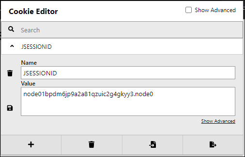
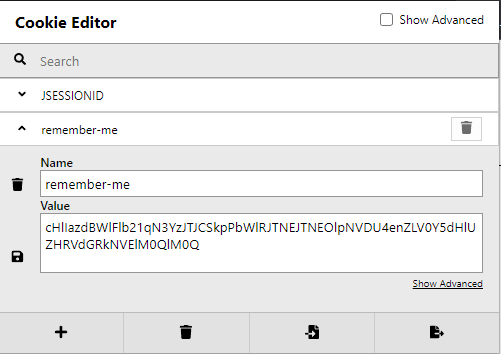

# Part 7. Spring Web Security를 이용한 로그인 처리

권한관리는 항상 중요한 부분인데, 잘 모르는 부분이 많다. 이번 기회에 기초를 쌓고 더 공부할 수 있는 발판을 만들어보자!


## 30. Spring Web Security 소개

* 스프링 시큐리티의 기본 동작은 여러 종류의 `Filter`와 `Intercepter`를 통해서 처리됨
  * Filter: Servlet에서의 Filter, 스프링과는 무관한 서블릿 자원
  * Intercepter: 스프링에서 필터와 유사한 역활을 함, 스프링의 빈으로 관리되며, 스프링 컨텍스트 안에 속함


### 30.1 Spring Web Security의 설정

* 단순 프로젝트인 Part02 의 예제 프로젝트를 수정해서 ex06, jex07프로젝트를 만들자.

* 라이브러리 추가

  ```xml
  <properties>
    <spring-security.version>스프링 시큐리티 버전</spring-security.version>
  </properties>
  
  <!-- Spring Security -->
  <dependency>
    <groupId>org.springframework.security</groupId>
    <artifactId>spring-security-web</artifactId>
    <version>${spring-security.version}</version>
  </dependency>
  
  <dependency>
    <groupId>org.springframework.security</groupId>
    <artifactId>spring-security-config</artifactId>
    <version>${spring-security.version}</version>
  </dependency>
  
  <dependency>
    <groupId>org.springframework.security</groupId>
    <artifactId>spring-security-core</artifactId>
    <version>${spring-security.version}</version>
  </dependency>
  
  <dependency>
    <groupId>org.springframework.security</groupId>
    <artifactId>spring-security-taglibs</artifactId>
    <version>${spring-security.version}</version>
  </dependency>
  
  
  ```


#### 30.1.1 security-context.xml 생성

```xml
<?xml version="1.0" encoding="UTF-8"?>
<beans xmlns="http://www.springframework.org/schema/beans"
  xmlns:xsi="http://www.w3.org/2001/XMLSchema-instance"
  xmlns:security="http://www.springframework.org/schema/security"
  xsi:schemaLocation="http://www.springframework.org/schema/beans https://www.springframework.org/schema/beans/spring-beans.xsd http://www.springframework.org/schema/security https://www.springframework.org/schema/security/spring-security.xsd">

</beans>

```


#### 30.1.2 web.xml 설정


Java Config 기반 설정은 이후에 따로 설명해주시니, 지금 고려하지 않아도 되겠다. 😄😄😄


### 30.2 시큐리티가 필요한 URI 설계

* 예제 URI 설계
  * `/sample/all` > 로그인을 하지 않은 사용자도 접근 가능
  * `/sample/member` > 로그인 한 사용자들만 접근 가능
  * `/sample/admin` > 로그인 사용자 중 관리자 권한을 가진 사용자만 접근 가능


### 30.3 인증(Authentication)과 권한 부여(Authorization - 인가)

* 인증

  * 자기자신을 증명
  * 본인이 무엇인가를 증명

* 권한 부여

  * 남에 의해서 자격이 부여됨

    

* AuthenticationManager
  * 다양한 방식의 인증을 처리할 수 있도록 설계됨.
* ProviderManager
  * 인증에 대한 처리를 AuthenticationProvider라는 타입의 객체를 이용해서 처리를 위임함.
* AuthenticationProvider
  * 실제 인증 작업 진행
  * 인증된 정보에는 권한에 대한 정보를 같이 전달하게 되는데, 이 처리는 UserDetailService와 관련이 있음.


개발자가 스프링 시큐리티를 커스터마이징하는 방식은 AuthenticationManager을 직접 구현하는 방식과 실제 처리를 담당하는 UserDetailService를 구현하는 방식으로 나누어짐.


## 31. 로그인과 로그아웃 처리


### 31.1 접근제한 설정


### 31.2 단순로그인 처리

* 주의사항
  * 일반 시스템에서의 `userid`는 스프링 시큐리티에서 `username` 에 해당함, 사용자의 이름으로 혼동하지 말것!
  * 스프링 시큐리티의 User
    * 인증 정보와 권한을 가진 객체, 일반적인 사용자 정보와는 다름.

* PasswordEncoder 없이 로그인을 하려할 때.. 다음과 같은 예외가 나올 수 있음.

  ```
  java.lang.IllegalArgumentException: There is no PasswordEncoder mapped for the id "null"
  ```

  * Spring Security 5 부터 암호에 대해 PasswordEncoder를 기본으로 사용하도록 설정되었기 때문이고, 연습용으로서 필요없다면 아래처럼 패스워드 문자열 앞부분에 `{noop}` 문자열을 삽입한다.

    ```xml
     <security:user name="member" password="{noop}member" authorities="ROLE_MEMBER" />
    ```

    

#### 31.2.1 로그아웃 확인

* 개발 학습을 하면서 로그인 로그아웃을 자주해야하는데, 로그아웃을 위해서 기능 구현을 아직 하지 않았다면, 브라우저에서 세션과 관련된 정보를 지우는 것이 확실함.

  * 로그인 상태에서 Cookie Editor로 보았을 때, `JSESSIONID` 쿠키에 값이 할당 되어있는 것을 확인했다. 해당 쿠키를 지우면 로그인이 풀림.

    


### 31.2.2 여러 권한을 가지는 사용자 설정

* admin 관련 설정추가하고, member로 로그인후 admin 페이지 접근시 403 응답 확인했음.


### 31.2.3 접근 제한 메시지의 처리

접근 제한에 대해서 AccessDeniedHandler를 직접 구현 또는 특정 URI를 지정할 수 있음.

* Access Denied의 경우 403 에러 메시지가 발생함.
* JSP에서는 HttpServletRequest 안에 `SPRING_SECURITY_403_EXCEPTION`이라는 이름으로 `AccessDeniedException` 객체가 전달됨


### 31.2.4 AccessDeniedHandler 인터페이스를 구현하는 경우

* 접근이 제한 되었을 때, 쿠키나 세션에 특정한 작업을 하거나 HttpServletResponse에 특정한 헤더정보를 추가하는 등의 행위를 할 경우는 직접 구현하는 방식이 권장됨.

* CustomAccessDeniedHandler 에서 리다이렉트를 하긴했는데...

  accessDeniedException 에 대한 정보를 리다이렉트 페이지로 전달하지 않았으므로... SPRING_SECURITY_403_EXCEPTION 관련 메시지는 표시되지 않는다.

  * 기본 내장 AccessDeniedHandlerImpl 에서는  예외정보를 request에 속성으로 설정하고 포워딩을 한다.

    ```java
    // Put exception into request scope (perhaps of use to a view)
    request.setAttribute(WebAttributes.ACCESS_DENIED_403, accessDeniedException);
    // Set the 403 status code.
    response.setStatus(HttpStatus.FORBIDDEN.value());
    // forward to error page.
    if (logger.isDebugEnabled()) {
        logger.debug(LogMessage.format("Forwarding to %s with status code 403", this.errorPage));
    }
    request.getRequestDispatcher(this.errorPage).forward(request, response);
    ```

    


### 31.3 커스텀 로그인 페이지

* CSRF 토큰 

  ```html
  <input type="hidden" name="${_csrf.parameterName}" value="${_csrf.token}">
  ```

  * 브라우저에서 확인
    ```html
    <input type="hidden" name="_csrf" value="363f36a0-4bd4-42b2-a100-ad021c217135">
    <!-- 로그아웃 후 다시 확인하니 값이 바뀌어 있다. -->
    <input type="hidden" name="_csrf" value="b2901297-935d-4b22-a8b3-5392da1d26ef">
    ```

보안 처리를 위해 넣어둔 것 같은데 아직은 잘 모르겠다.


### 31.4 CSRF(Cross-site request forgery) 공격과 토큰

* 사이트간 위조 방지를 목적으로 특정한 값의 토큰을 사용하는 방식
* CSRF 공격
  * 서버에서 받아들이는 요청을 해석하고 처리할 때 어떤 출처에서 호출이 진행 되었는지는 따지지 않기 때문에 생기는 허점을 노리는 공격방식
* 대응 방법
  * referer 헤더 체크
  * REST 방식에서 사용되는 PUT 또는 DELETE 사용


#### 31.4.1 CRSF 토큰

1. 서버에서 브라우저에 데이터를 전송할 때, CSRF 토큰을 전송
2. 사용자가 POST등으로 요청할 때, 요청내용의 CSRF값을 검사
   * 제공한 CSRF 토큰과 다르다면 처리하지 않음.


#### 31.4.2 스프링 시큐리티의 CSRF 설정

* CSRF 토큰은 세션을 통해 보관하고 브라우저에서 전송된 CSRF 토큰 값을 검사하는 방식으로 처리.
* 비활성화 할 수도 있음.


### 31.5 로그인 성공과 AuthenticationSuccessHandler

* 브라우저에서 단지 뒤로가기해서 CSRF 토큰이 갱신되지 않은 상태라면 로그인이 안된다, 새로고침을 눌러줘야함.


### 31.6 로그아웃의 처리와 LogoutSuccessHandler

* POST 방식으로 처리되기 때문에, CSRF 토큰값을 지정함.
* 추가적인 작업을 원한다면 logoutSucessHandler을 정의해야함.


## 32. JDBC를 이용하는 간편 인증/권한 처리


* UserDetailsService는 다음 구현 클래스를 제공함
  * CachingUserDetailsService
  * InMemoryUserDetailsManager
  * JdbcDaoImpl
  * JdbcUserDetailsManager
  * LdapUserDetailsManager
  * LdapUserDetailsService


### 32.1 JDBC를 이용하기 위한 테이블 설정

* JdbcUserDetailsManager

  * https://github.com/spring-projects/spring-security/blob/5.7.1/core/src/main/java/org/springframework/security/provisioning/JdbcUserDetailsManager.java

* 스프링 시큐리티에서 지정된 SQL을 그대로 사용하고 싶을 때, 아래와 같이 테이블을 생성해줌.

  ```sql
  -- 기본 User 스키마
  create table users(
  	username varchar_ignorecase(50) not null primary key,
  	password varchar_ignorecase(500) not null,
  	enabled boolean not null
  );
  
  create table authorities (
  	username varchar_ignorecase(50) not null,
  	authority varchar_ignorecase(50) not null,
  	constraint fk_authorities_users foreign key(username) references users(username)
  );
  create unique index ix_auth_username on authorities (username,authority);
  
  
  
  -- Oracle DB를 위한 기본 User 스키마
  CREATE TABLE USERS (
      USERNAME NVARCHAR2(128) PRIMARY KEY,
      PASSWORD NVARCHAR2(128) NOT NULL,
      ENABLED CHAR(1) CHECK (ENABLED IN ('Y','N') ) NOT NULL
  );
  
  
  CREATE TABLE AUTHORITIES (
      USERNAME NVARCHAR2(128) NOT NULL,
      AUTHORITY NVARCHAR2(128) NOT NULL
  );
  ALTER TABLE AUTHORITIES ADD CONSTRAINT AUTHORITIES_UNIQUE UNIQUE (USERNAME, AUTHORITY);
  ALTER TABLE AUTHORITIES ADD CONSTRAINT AUTHORITIES_FK1 FOREIGN KEY (USERNAME) REFERENCES USERS (USERNAME) ENABLE;
  
  
  -- ORACLE 기준 테스트 유저 데이터 입력
  INSERT INTO USERS (USERNAME, PASSWORD, ENABLED) VALUES ('user00', 'pw00', 'Y');
  INSERT INTO USERS (USERNAME, PASSWORD, ENABLED) VALUES ('member00', 'pw00', 'Y');
  INSERT INTO USERS (USERNAME, PASSWORD, ENABLED) VALUES ('admin00', 'pw00', 'Y');
  
  INSERT INTO AUTHORITIES (USERNAME, AUTHORITY) VALUES ('user00', 'ROLE_USER');
  INSERT INTO AUTHORITIES (USERNAME, AUTHORITY) VALUES ('member00', 'ROLE_MANAGER');
  INSERT INTO AUTHORITIES (USERNAME, AUTHORITY) VALUES ('admin00', 'ROLE_MANAGER');
  INSERT INTO AUTHORITIES (USERNAME, AUTHORITY) VALUES ('admin00', 'ROLE_ADMIN');
  ```

  * 클래스 리소스로도 사용할 수 있음.
    * `org/springframework/security/core/userdetails/jdbc/users.ddl`
  * 가이드 문서
    * `5.7.1 버전`
      * https://github.com/spring-projects/spring-security/blob/5.7.1/docs/modules/ROOT/pages/servlet/authentication/passwords/jdbc.adoc
    * `main` 브랜치
      * https://github.com/spring-projects/spring-security/blob/main/docs/modules/ROOT/pages/servlet/authentication/passwords/jdbc.adoc

#### ex06 프로젝트에 datasource 추가

 *  spring-jdbc만 써서 mybatis 설정을 할필요가 없다.

    

#### 32.1.1 PasswordEncoder 문제 해결

`/sample/admin` 에 접근하여 로그인 페이지에 ID와 암호를 정상 입력하고 접근해보면, 아래와 같은 예외가 발생한다.

```
java.lang.IllegalArgumentException: There is no PasswordEncoder mapped for the id "null"
	at org.springframework.security.crypto.password.DelegatingPasswordEncoder$UnmappedIdPasswordEncoder.matches(DelegatingPasswordEncoder.java:289)
	...
```

* Database를 사용할 때는 PasswordEncoder를 사용해야함.
* 현재 예제에서는 암호화 없이 처리하도록 PasswordEncoder를 구현해서 사용하기로함.
* CustomNoOpPasswordEncoder 는 security-context.xml에 등록

이후 다시 로그인 시도해보면 잘 수행됨.


### 32.2 기존 테이블을 이용하는 경우

기존 회원관련 데이터 베이스가 구축되어있을 때, 스프링 시큐리티의 기본 테이블 구조를 섞어 사용하는 것은 오히려 복잡해질 수 있음.

* JDBC를 이용하고 기존에 테이블이 있다면 지정된 결과를 반환하는 쿼리를 작성해주는 작업으로도 처리가 가능함.

* `<security:jdbc-user-service> 의 아래 속성에 적당한 쿼리 지정`
  * `users-by-username-query`
  * `authorities-by-user-name-query`


#### 32.2.1 인증/권한을 위한 테이블 설계

책에서 제시한 테이블이 스프링 시큐리티 기본 제공 테이블 스키마와 크게 차이는 없지만, 사용자 테이블에 이름(username), 등록일시(regdate), 업데이트일시(updatedate) 등의 추가정보가 들어가 있다.

* 스프링 시큐리티의 기본 스키마의 username은 ID개념임.

* 사용여부(enabled)에 대해서...

  스프링 시큐리티의 기본 스키마는 `ENABLED CHAR(1) CHECK (ENABLED IN ('Y','N') ) NOT NULL` 이렇게 되어있는데... 들어오는 값을 Y, N으로 고정하고 있다. 

  그런데 책에서는 boolean으로 처리하려고 한 것인지 기본 값을 '1'로 하고 있다. 이부분은 스프링 시큐리티 기본 스키마 정의를 따르고, 내가 잘 조정해서 바꿔야겠다.

  

* 일반적인 회원 테이블과 권한 테이블

  ```sql
  CREATE TABLE TBL_MEMBER(
    USERID        VARCHAR2(50)    NOT NULL PRIMARY KEY,
    USERPW        VARCHAR2(100)   NOT NULL,
    USERNAME      VARCHAR2(100)   NOT NULL,
    REGDATE       DATE            DEFAULT SYSDATE,
    UPDATEDATE    DATE            DEFAULT SYSDATE,
    ENABLED       CHAR(1) CHECK (ENABLED IN ('Y','N') ) NOT NULL 
    /* ENABLED       CHAR(1)         DEFAULT '1' 대신 위처럼 사용해보자., 유저 추가시 활성화/비활성화 여부는 서비스에서 결정하자. */
  );
  
  CREATE TABLE TBL_MEMBER_AUTH (
    USERID        VARCHAR2(50)    NOT NULL,
    AUTH          VARCHAR2(50)    NOT NULL,
    CONSTRAINT    FK_MEMBER_AUTH  FOREIGN KEY(USERID) REFERENCES TBL_MEMBER(USERID)
  );
  ```


#### 32.2.2 BCryptPasswordEncoder 클래스를 이용한 패스워드 보호

* bcrypt
  * 패스워드를 저장하는 용도로 설계된 해시함수로 특정 문자열을 암호화하고, 체크하는 쪽에서는 암호화된 패스워드가 유효한 패스워드인지만 확인하고 다시 원문으로 되돌리지는 못함.
* Password Encoder로 BCryptPasswordEncoder로 사용


##### 인코딩된 패스워드를 가지는 사용자 추가

* 태스트 클래스를 만들어서 인코딩된 사용자를 DB에 넣어주자!
* `spring-test`는 이미 디펜던시에 추가되어있음.
* 저자님께서는 `Connection`, `PreparedStatement` 등등 사용하셨는데, jdbc 템플릿 사용해보자!
  * **MemberTest**
    * `NamedParameterJdbcTemplate` 로 사용했고, 회원과 회원 권한에 대해 별도 도메인 클래스 만들어서 거기에 값을 설정하고 `BeanPropertySqlParameterSource` 사용해서 매핑이 쉽도록 작성했다.


#### 사용자에 권한 추가하기

* 권한을 직접 문자열로 사용하기 싫어서 enum으로 정의했는데, `BeanPropertySqlParameterSource` 를 그대로 사용할 수가 없었다. 다음과 같이 getValue()를 오버라이드 해주면 정상 입력할 수 있었다.

  ```java
  public class CustomBeanPropertySqlParameterSource extends BeanPropertySqlParameterSource {
    public CustomBeanPropertySqlParameterSource(Object object) {
      super(object);
    }
  
    /** enum 인식을 위해 getValue() 메서드를 오버라이드 */
    @Override
    public Object getValue(String paramName) throws IllegalArgumentException {
      Object value = super.getValue(paramName);
      if (value instanceof Enum) {
        return value.toString();
      }
      return value;
    }
  }
  ```

  

### 32.2.3 쿼리를 이용하는 인증

* security-context.xml에 다음과 같이 지정

  ```xml
  <!-- SELECT 컬럼 순서만 맞으면, 컬럼명이 기본과 다른 것은 상관 없는 것 같다. -->
  <security:jdbc-user-service data-source-ref="dataSource"
    users-by-username-query="SELECT USERID, USERPW, ENABLED FROM TBL_MEMBER WHERE USERID = ?"
    authorities-by-username-query="SELECT USERID, AUTH FROM TBL_MEMBER_AUTH WHERE USERID = ?"/>
  ```

 *  특정 유저의 `ENABLED` 컬럼 값을 N으로 변경했을 때, 로그인이 되지 않는 것도 확인했다.

    ```sql
    UPDATE TBL_MEMBER 
       SET ENABLED = 'N'
     WHERE USERID = 'admin90'
    ```

    


## 33. 커스텀 UserDetailsService 활용

> 먼저번 장에서 JDBC 그냥 쓰는게 불편하다고 생각했는데, 이번 챕터에서는 도메인도 만들고, ORM (MyBatis)도 사용한다.  먼저 장에서 내맘대로 만들어둔 도메인은 이번장하고 이름이나 형태를 맞춰놔야겠다.

* UserDetailsService 의 메서드

  ```java
  /*
  사용자 이름을 기반으로 사용자를 찾습니다. 실제 구현에서 검색은 구현 인스턴스가 구성되는 방식에 따라 대소문자를 구분하거나 대소문자를 구분하지 않을 수 있습니다. 이 경우 반환되는 UserDetails 개체는 실제로 요청된 것과 다른 대소문자를 가진 사용자 이름을 가질 수 있습니다.
  */
  UserDetails loadUserByUsername(java.lang.String username) throws UsernameNotFoundException;
  ```

  * https://docs.spring.io/spring-security/site/docs/current/api/org/springframework/security/core/userdetails/UserDetailsService.html


* UserDetails 인터페이스

  ```
  Package org.springframework.security.core.userdetails
  Interface UserDetails
  
      All Superinterfaces:
          java.io.Serializable
  
      All Known Subinterfaces:
          LdapUserDetails
  
      All Known Implementing Classes:
          InetOrgPerson, LdapUserDetailsImpl, Person, User 
  ```

  * 일반적으로 User를 상속해서 사용함.
  * MyBatis와 사용시 MemberMapper와 서비스를 작성하고, 스프링 시큐리티와 연동해서 사용하는 방식으로 진행


### 33.1 회원 도메인, 회원 Mapper 설계

* 전장에서 만들었던 도메인 다시 책에 맞게 바꿨다. 😅
* 주목한 부분 MemberVO가 권한 리스트를 갖는다는 것, 한 유저가 여러 권한을 가질 수 있으므로 그렇게 하셨다보다.


#### 33.1.1 MemberMapper

* MyBatis 설정을 다시 추가해야함... 필요없는줄 알고 빼놨었는데..😅
* 회원 정보에 권한 정보를 조인해서 가져올 것이므로 ResultMap을 구성해야한다.


#### 33.1.2 MemberMapper 테스트

* MyBatis EnumType Handler 보고 code 기반으로 처리할 수도 있도록 클래스를 새로 만들었는데.. Enum 저장 및 변환 잘 되는 것 확인했다.


### 33.2 CustomUserDetailsService 구성

* `authentication-provider`에  `user-service-ref` 선언하면 `jdbc-user-service` 설정 내용은 제거해야한다.


#### 33.2.1 MemberVO를 UsersDetails 타입으로 변환하기

* super의 생성자를  사용하는 `public CustomUser(MemberVO vo)` 를 구현하므로 아래 기본 생성자는 빼도 될 것 같다.

  ```java
  public CustomUser(
    String username, String password, Collection<? extends GrantedAuthority> authorities) {
    super(username, password, authorities);
  }
  ```

* 유저 없을 때 null을 반환하는 것이 이상해서... `UsernameNotFoundException` 예외를 던지도록 하였다.

  ```java
    @Override
    public UserDetails loadUserByUsername(String userName) throws UsernameNotFoundException {
      LOGGER.warn("Load User by userName: {}", userName);
  
      MemberVO member = memberMapper.read(userName);
  
      LOGGER.warn("queried by member mapper: {}", member);
  
      if (member == null) {
        throw new UsernameNotFoundException("userName: " + userName);
      }
      return new CustomUser(member);
    }
  ```


## 34 스프링 시큐리티를 JSP에서 사용하기


### 34.1 JSP에서 로그인한 사용자 정보 보여주기

* 앞 챕터에서 CustomUser에 member 필드에 대한 Getter 설정 내가 누락해서 넣었다. 😅


### 34.2 표현식을 이용하는 동적 화면 구성

* 스프링 시큐리티에서 자주 사용되는 표현식

  | 표현식                                                 | 설명                                                     |
  | ------------------------------------------------------ | -------------------------------------------------------- |
  | hasRole(\[role])<br />hasAuthority(\[authority])       | 해당 권한이 있으면 true                                  |
  | hasAnyRole(\[role])<br />hasAnyAuthority(\[authority]) | 여러 권한들 중에서 하나라도 해당하는 권한이 있으면 true  |
  | principal                                              | 현재 사용자 정보를 의미                                  |
  | permitAll                                              | 모든 사용자에게 허용                                     |
  | denyAll                                                | 모든 사용자에게 거부                                     |
  | isAnonymous()                                          | 익명의 사용자의 경우 (로그인을 하지 않은 경우도 해당)    |
  | isAuthenticated()                                      | 인증된 사용자면 true                                     |
  | isFullyAuthenticated()                                 | Remember-me로 인증된 것이 아닌 인증된 사용자인 경우 true |

  


## 35 자동 로그인 (remember-me)

* 자동로그인 `remember-me`라고도 하고, Cookie를 이용해서 구현함.
* 스프링 시큐리티에서는 `remember-me`를 메모리 또는 DB를 이용하는 형태로 약간의 설정만으로 구현 가능함.


### 35.1 데이터베이스를 이용하는 자동로그인

##### 동작 방식

1. 로그인 할 때, 로그인이 되었던 정보를 DB에 저장
2. 사용자 재방문시 세션에 정보가 없으면 데이터 베이스를 조회


##### 세션 방식보다 좋은점

* 보통 웹서버가 다중 서버로 구성되는데, 세션으로하게 하려면 웹서버간 메모리가 공유되야 제대로 쓸 수 있지 않을지?
  * 저장소가 DB라면 다중 웹서버라도 하나의 DB를 바라보므로 더 간편하고 안정적일 것 같다.


#### 테이블 정의

* https://docs.spring.io/spring-security/reference/servlet/authentication/rememberme.html#remember-me-persistent-token

  ```sql
  CREATE TABLE PERSISTENT_LOGINS (
    USERNAME   VARCHAR2(64)  NOT NULL,
    SERIES     VARCHAR2(64)  PRIMARY KEY,
    TOKEN      VARCHAR2(64)  NOT NULL,
    LAST_USED  TIMESTAMP     NOT NULL
  );
  ```
  
  * `VARCHAR` 만 `VARCHAR2`로 변경


#### security-context.xml 수정

```xml
<security:http>
  ...
  <security:remember-me data-source-ref="dataSource" token-validity-seconds="604800"/>
  ...
</security:http>
```

* `token-validity-seconds`: Remember-me 쿠키가 유효한 기간(초) 설정
  * 예제에서는 1주일(7일)을 초로 입력했다.


### 35.1.1 로그인 화면에 자동 로그인 설정

* 로그인 화면에서 체크박스 형태로 구현

`remember-me`란 name을 갖는 체크 박스를 만들어 체크한후 로그인을 해보면, 아래와 같은 쿠키가 만들어진 것을 확인할 수 있다.



* `PERSISTENT_LOGINS` 테이블을 확인해보았을 때, 다음 행이 추가된 것을 확인함.

  | USERNAME | SERIES                   | TOKEN                    | LAST\_USED                 |
  | :------- | :----------------------- | :----------------------- | :------------------------- |
  | admin90  | pyHk7AZQeomj7v3+JJOmiQ== | ZMT58zvKWF9tyTdtUtdd5Q== | 2022-06-24 09:27:00.879000 |

* 자동 로그인이 될 때마다 `TOKEN`과 `LAST_USED` 값은 갱신됨


### 35.1.2  로그아웃 시 쿠키 삭제

* 로그아웃을 할 때, 자동 로그인 쿠키를 삭제해주는 내용을 `security-context.xml`에 추가

  ```xml
    <security:http>
      <security:logout logout-url="/customLogout"
                       invalidate-session="true"
                       delete-cookies="remember-me,JSESSION_ID,JSESSIONID"/>
  		...
    </security:http>
  ```

  * 별도 설정이 없으면 자동 로그인에서 사용하는 쿠키명이 `remember-me` 이므로 그것을 삭제할 쿠키명으로 지정해주면 되고, Tomcat 등이 발행하는 쿠키도삭제해주는 것이 좋다고 하신다. (Jetty도 `JSESSIONID`란 쿠키를 만듬)
    * remember-me가 없어지는 것은 확인이 되는데... JSESSIONID같은 경우는 서버에 접근하면 새로만들어서인지 몰라도 남아있다.


* 부모 POM.xml에 cargo를 적용해 두었으니 톰캣으로 확인하고 싶을 때는... 아래와 같이 해보자.

  ```bash
  # 시작
  $ mvn clean package -DskipTests cargo:run
  # 정지
  $ mvn cargo:stop
  ```

  * cargo 플러그인을 통해 `Tomcat 9.x`로 실행시도 JSESSIONID로 쿠키를 만들었다. `JSESSION_ID` 의 삭제설정은 빼도 될 것 같다.


## 36 Java 설정을 이용하는 경우의 스프링 시큐리티 설정


---

## jex06 프로젝트 진행 특이사항

* 그런데 진행을 하면 할 수록 `mybatis-dymamic-sql` 대신 `JPA`를 제대로 배워서 사용하는 것이 나을 것 같다는 생각도 들지만, 내가 이 모듈의 사용에 여전히 익숙하지 않아서 그런 것이기도 하니 의미 없게 보지는 말자...😑


### mybatis-dynamic-sql에서 JOIN  처리

* MemberService에다 만든 JOIN 쿼리 생성문

  ```java
    public Optional<MemberVO> read(String userId) {
      return memberMapper.selectOne(
          select(
                  MemberVODynamicSqlSupport.userId,
                  MemberVODynamicSqlSupport.userPassword,
                  MemberVODynamicSqlSupport.userName,
                  MemberVODynamicSqlSupport.enabled,
                  MemberVODynamicSqlSupport.registerDate,
                  MemberVODynamicSqlSupport.updateDate,
                  AuthVODynamicSqlSupport.auth)
              .from(MemberVODynamicSqlSupport.memberVO, "m")
              .leftJoin(
                  AuthVODynamicSqlSupport.authVO,
                  "a",
                  on(MemberVODynamicSqlSupport.userId, equalTo(AuthVODynamicSqlSupport.userId)))
              .where(MemberVODynamicSqlSupport.userId, isEqualTo(userId))
              .build()
              .render(RenderingStrategies.MYBATIS3));
    }
  ```

  * m과 a로 쓴 것은 단순 alias이다. 실행로그보면 제대로 적용된 것을 볼 수 있다.

    ```
    DEBUG: org.fp024.mapper.MemberMapper.selectOne - ==>  Preparing: select m.USERID, m.USERPW, m.USERNAME, m.ENABLED, m.REGDATE, m.UPDATEDATE, a.AUTH from TBL_MEMBER m left join TBL_MEMBER_AUTH a on m.USERID = a.USERID where m.USERID = ?
    DEBUG: org.fp024.mapper.MemberMapper.selectOne - ==> Parameters: admin90(String)
    ```

    

* ResultMap 처리

  * 회원과 권한이 1:N 관계여서 ResultMap을 설정해 줄 수 밖에 없는데, 라이브러리 개발자분이 매퍼XML에 ResultMap을 정의해서 사용하라고 한다.

  * https://mybatis.org/mybatis-dynamic-sql/docs/select.html#xml-mapper-for-join-statements

  * MemberMapper 인터페이스

    ```java
    @Generated("org.mybatis.generator.api.MyBatisGenerator")
    @SelectProvider(type = SqlProviderAdapter.class, method = "select")
    @ResultMap("MemberResultMap")
    Optional<MemberVO> selectOne(SelectStatementProvider selectStatement);
    ```

  * MemberMapper.xml에 MemberResultMap을 정의

    ```xml
    ...
    <mapper namespace="org.fp024.mapper.MemberMapper">
      <resultMap id="MemberResultMap" type="memberVO">
        <id property="userId" column="userid"/>
        <result property="userPassword" column="userpw"/>
        <result property="userName" column="username"/>
        <result property="enabled" column="enabled" typeHandler="org.fp024.typehandler.CustomEnumTypeHandler"/>
        <result property="registerDate" column="regdate"/>
        <result property="updateDate" column="updateDate"/>
        <collection property="authList" resultMap="AuthResultMap"/>
      </resultMap>
    
      <resultMap id="AuthResultMap" type="authVO">
        <result property="userId" column="userId"/>
        <result property="auth" column="auth" typeHandler="org.fp024.typehandler.CustomEnumTypeHandler"/>
      </resultMap>
    
    </mapper>
    ```

    여기서는 타입핸들러 클래스를 풀패키지이름으로 적어줘야만 했다. 😓

  

이 모듈로 JOIN을 어떻게 처리 해야하나 했는데, 그래도 잘 적용한 것 같다. 😄


### 36.1 Java 설정 추가 및 동작 확인

web.xml이 없고 WebCofnig 클래스를 추가해서 사용하는 경우 2가지 방법 중 하나로 설정

1. getServletfilters()를 이용해서 직접 스프링 시큐리티 관련 필터 추가
2. AbstractSecurityWebApplicationInitializer 클래스를 사용하는 클래스 추가


### WebSecurityConfigurerAdapter 의 지원중단

Spring Security 5.7.2 에서는 `WebSecurityConfigurerAdapter` 가 Deprecated 되었다고 나온다.

```
Use a org.springframework.security.web.SecurityFilterChain Bean to configure HttpSecurity or a WebSecurityCustomizer Bean to configure WebSecurity
```


* 최신 가이드
  * https://spring.io/blog/2022/02/21/spring-security-without-the-websecurityconfigureradapter

    ```java
    @Configuration
    @EnableWebSecurity
    @Slf4j
    public class SecurityConfig {
      @Bean
      public SecurityFilterChain filterChain(HttpSecurity http) throws Exception {
        http.authorizeHttpRequests(
            (auths) ->
                auths
                    .antMatchers("/sample/all")
                    .permitAll()
                    .antMatchers("/sample/admin")
                    .hasRole(MemberAuthType.ROLE_ADMIN.name())
                    .antMatchers("/sample/member")
                    .hasRole(MemberAuthType.ROLE_MEMBER.name()));
        return http.build();
      }
    }
    ```

WebSecurityConfigurerAdapter 상속하지 않고 SecurityFilterChain를 빈으로 구성해서 쓰는 것을 추천하라고 해서 책에 내용을 요즘 기준에 맞춰서 바꿔 적었다.

* 그런데 lambda 안쓰다보니 많이 잊어버림 😓😓😓, 좀만 복잡해지면 뭔말인지 모르겠음...


#### 36.1.1 WebConfig 클래스의 변경

여기까지 해서 실행해보면 아래 예외가 발생

```
org.springframework.beans.factory.NoSuchBeanDefinitionException: No bean named 'springSecurityFilterChain' available
```

WebConfig 클래스에 SecurityConfig.class도 추가를 해줘야한다.

```java
// ...
  @Override
  protected Class<?>[] getRootConfigClasses() {
    return new Class<?>[] {RootConfig.class, SecurityConfig.clas};
  }
// ...
```


### 36.2 로그인 페이지 관련 설정

* 인메모리 유저 처리하는 방식도 최신 가이드가 있는데... 책의 내용을 아래와 같이 수정했다.

  ```java
    @Bean
    public InMemoryUserDetailsManager userDetailsService() {
      UserDetails user =
          User.withDefaultPasswordEncoder()
              .username("admin")
              .password("admin")
              .roles(MemberAuthType.ROLE_ADMIN.name())
              .username("member")
              .password("member")
              .roles(MemberAuthType.ROLE_MEMBER.name())
              .build();
      return new InMemoryUserDetailsManager(user);
    }
  ```

  `withDefaultPasswordEncoder()` 메서드는 Deprecated로 되어있지만, 프로덕션에 올라가면 위험하다는 것을 나타내기 위해 표시한 것이고 실제로 제거하진 않을 거라고 함.


#### 36.2.1 로그인 성공 처리

* ex06 프로젝트에서 만들었던 CustomLoginSuccessHandler를 빈으로 등록

* 그런데.. `ROLE_` 은 자동으로 추가되므로 쓸필요가 없다는 오류가나는데...

  * 일단 MemberAuthType을 ROLE에 대한 유저명만 가져올 수도 있게 변경했다.

    ```java
    public enum MemberAuthType {
      ROLE_USER("USER"),
      ROLE_MEMBER("MEMBER"),
      ROLE_ADMIN("ADMIN");
    
      @Getter() private String roleUserName;
    
      MemberAuthType(String roleUserName) {
        this.roleUserName = roleUserName;
      }
    }
    ```


### 36.3 로그아웃 처리

```
로그인 전 JSESSIONID 값
node01u2nn77dlc7e51kmmxk6j6eq400.node0
로그인 후 JSESSIONID 값, 달라진 것을 확인했다.
node0ivqaqpeh7z1554cdjlafanxt1.node0
```


### 36.4 PasswordEncoder 지정

PasswordEncoder를 빈으로 지정해서 테스트 했을 때... 아래와 같은 식으로 인코딩 된 문자열로 잘 나타났다.

```
encoded text: $2a$10$cwpVKNhU4h1P4xPT0h1ss.yfLTwZT9PjcCpAAMEZ3ZAwwxNCuoXSS
```

실제로 확인하기 위해서 

`.withDefaultPasswordEncoder()` 를 제거하고 실행하자!

```java
  @Bean
  public InMemoryUserDetailsManager userDetailsService() {
    UserDetails user =
        User.withUsername("admin")
            .password("admin")
            .roles(MemberAuthType.ROLE_ADMIN.getRoleUserName())
            .username("member")
            .password("$2a$10$cwpVKNhU4h1P4xPT0h1ss.yfLTwZT9PjcCpAAMEZ3ZAwwxNCuoXSS")
            .roles(MemberAuthType.ROLE_MEMBER.getRoleUserName())
            .build();
    return new InMemoryUserDetailsManager(user);
  }
```

admin은 패스워드 인코딩 처리가 되지않아 로그인이 안될 테지만, member는 로그인이 되야한다. > 잘 됨을 확인했다.


### 36.5 JDBC를 이용하는 Java 설정

* JSP 에서 예외발생시 JSP 내용중 한글이 깨져보여서 인코딩 필터 순서를 조절해보았는데, 결과는 같았다.

  ```java
  public class SecurityInitializer extends AbstractSecurityWebApplicationInitializer {
    @Override
    protected void beforeSpringSecurityFilterChain(ServletContext servletContext) {
      FilterRegistration.Dynamic encodingFilter =
          servletContext.addFilter(
              "encodingFilter", new CharacterEncodingFilter(StandardCharsets.UTF_8.name(), true));
      encodingFilter.addMappingForUrlPatterns(
          null, false, "/*"); // 첫번째 인자 dispatcherTypes를 null로 두면 REQUEST로 인식 한다고 함.
    }
  }
  ```

  그래도 Spring Security 의 필터보다 인코딩 필터가 먼저 수행되는 것을 JSP 예외발생시 스택 추적 로그로 확인하여서, 이대로 두자~

  * 참조: https://stackoverflow.com/questions/20863489/characterencodingfilter-dont-work-together-with-spring-security-3-2-0


### 36.6 커스텀 UserDetailsService 설정

* AuthenticationManagerBuilder에 customUserService, passwordEncoder의 설정은 어떻게 하나? 했는데, 그냥 빈으로 지정해두면 알아서 `AuthenticationManager` 를 생성하는 것 같다.

  괜히 따로 메서드를 만들면 빈 중복 오류가 남.

  ```
  DaoAuthenticationConfigurer to already built object
  ```

* 아래 2개만 빈으로 설정되어있으면 됨

  ```java
   @Bean
    public UserDetailsService customUserDetailsService() {
      return new CustomUserDetailsService();
    }
  
    @Bean
    public PasswordEncoder passwordEncoder() {
      return new BCryptPasswordEncoder();
    }
  ```


### 36.7 자동 로그인 설정


## 37 어노테이션을 이용하는 스프링 시큐리티 설정

#### 주로 사용되는 어노테이션

* `@Secured`: 스프링 시큐리티 초기부터 사용됨, ()안에 `ROLE_ADMIN`과 같은 문자열 혹은 문자열 배열을 이용함.
* `@PreAuthorize`, `@PostAuthorize`: 3버전 부터 지원, ()안에 표현식을 사용할 수 있음

기존에 `MemberAuthType`으로 `enum`으로 만들어둔 것이 있어서,  `@PreAuthorize` 와 `@Secured`에 인식이되도록 static final String 으로 접근할 수 있는 내부 클래스를 만들었다.


#### 설정 추가 위치

스프링 시큐리티의 어노테이션을 활성화하기 위해서는 스프링 MVC 설정을 담당하는 servlet-context.xml에 관련 설정이 추가되야한다.

```xml
<security:global-method-security pre-post-annotations="enabled" secured-annotations="enabled"/>
```


### Java 설정일 경우...

ServletConfig 클래스에 아래 어노테이션을 추가해주자.

```java
@EnableGlobalMethodSecurity(prePostEnabled = true, securedEnabled = true)
```


---

## jex06-board 프로젝트 진행 특이사항

* 


---

## 의견

* 

  


## 정오표

* p628 
  * Custom`e`AccessDeniedHandler -> CustomAccessDeniedHandler


## 기타

