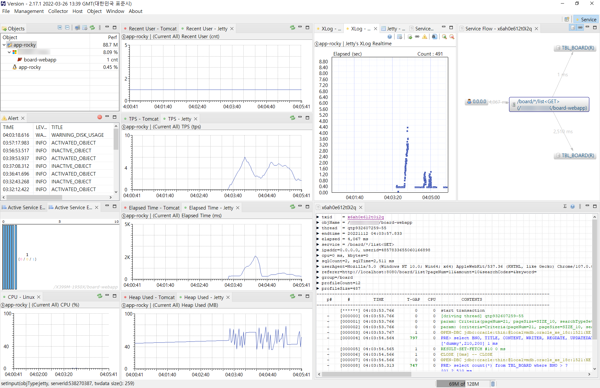

# Scouter 적용 테스트

> ✨ Scouter를 적용해보자! 


## Host Agent 실행 문제

#### 개인 사용자 커스터마이징 DLL 수정 파일

> 어떤 분이 컨버전을 한 것 같아서 받아서 DLL을 바꿔봤는데, Windows 10 + Java 8, 11, 17 환경에서는 여전히 안된다.

* https://github.com/cnstar9988/sigar/commit/9e5dba8

* sigar-amd64-winnt.dll
  * https://www.virustotal.com/gui/file/8713ce1cb22fb06af7148ea973809f66259d16cdb3f1666b4594f00f73c2a264

* 그래서 HostAgent 실행할 때에 한해서 Java 버전을 `7 Update 80`, `6 Update 45`로 낮춰봤는데.. 잘 동작한다.

  * `%Scouter_홈경로%\agent.host\host.bat `

    ```bat
    @call ..\..\setenv.bat
    @%JAVA_7_HOME%\bin\java -classpath ./scouter.host.jar   scouter.boot.Boot ./lib
    ```

    * setenv.bat에는 Java 7에 대한 경로 환경변수 설정을 해둠.


#### 그외 [Sigar](https://github.com/hyperic/sigar) 관련 이슈

* 시스템에 ODD 드라이브에 대해서 디스크 사용량 정보를 잘못처리해서 오류가 나는가보다. 😅
  * https://github.com/scouter-project/scouter/issues/740
    * 대안방법: ODD 드라이브 문자 제거


## Serlvet Container에 적용하기

Windows 환경에서 cargo 플러그인을 통한 Tomcat 9.x에는 적용함

* Scouter 수집 서버는 Rocky Linux 8 환경
* 웹 애플리케이션과 Host Agent는 Windows 10 환경
  * cargo로 tomcat 9.x 실행


### Scouter Java Agent 설정 파일

* `scouter/conf/board-webapp.conf`

  ```properties
  ### scouter java agent configuration sample
  obj_name=board-webapp
  net_collector_ip=lvm.scouter-server
  net_collector_udp_port=6100
  net_collector_tcp_port=6100
  #hook_method_patterns=sample.mybiz.*Biz.*,sample.service.*Service.*
  #trace_http_client_ip_header_key=X-Forwarded-For
  #profile_spring_controller_method_parameter_enabled=false
  #hook_exception_class_patterns=my.exception.TypedException
  #profile_fullstack_hooked_exception_enabled=true
  #hook_exception_handler_method_patterns=my.AbstractAPIController.fallbackHandler,my.ApiExceptionLoggingFilter.handleNotFoundErrorResponse
  #hook_exception_hanlder_exclude_class_patterns=exception.BizException
  
  ```

  * net_collector_ip 에는 Scouter 서버를 실행중인 Rocky Linxu 8 호스트명 넣었음.

### 환경 변수 정의  배치 파일 

* `setenv.bat`

  ```bat
  @SET SCOUTER_JAVA_AGENT_CONF=scouter\conf\board-webapp.conf
  @SET SCOUTER_JAVA_AGENT_LIB=C:\scouter\scouter\agent.java\scouter.agent.jar
  @SET LATEST_PROJECT_HOME=part07\ex06-board
  @echo SCOUTER_JAVA_AGENT_CONF=%SCOUTER_JAVA_AGENT_CONF%
  @echo SCOUTER_JAVA_AGENT_LIB=%SCOUTER_JAVA_AGENT_LIB%
  @echo LATEST_PROJECT_HOME=%LATEST_PROJECT_HOME%
  ```

  * SCOUTER_JAVA_AGENT_CONF: Java Agent 설정파일 경로
  * SCOUTER_JAVA_AGENT_LIB: Java Agent 라이브러리 파일 경로
  * LATEST_PROJECT_HOME: 적용할 프로젝트 홈 경로


### pom.xml에서 cargo 설정

* `study-dependencies-parent/pom.xml`

  ```xml
  <!-- 실제 Tomcat 9 배포 실행 테스트 -->
        <!-- mvn clean package -DskipTests cargo:run -->
        <plugin>
          <groupId>org.codehaus.cargo</groupId>
          <artifactId>cargo-maven3-plugin</artifactId>
          <version>${cargo.version}</version>
          
          <configuration>
            <container>
              <containerId>tomcat9x</containerId>
              <systemProperties>
                <file.encoding>UTF-8</file.encoding>
                <scouter.config>${project.basedir}/../../${scouter.config.file}</scouter.config>
              </systemProperties>
              <zipUrlInstaller>
                <url>https://repo.maven.apache.org/maven2/org/apache/tomcat/tomcat/${cargo-tomcat9x.version}/tomcat-${cargo-tomcat9x.version}.zip</url>
                <downloadDir>${project.build.directory}/downloads</downloadDir>
                <extractDir>${project.build.directory}/extracts</extractDir>
              </zipUrlInstaller>
            </container>
            <configuration>
              <type>standalone</type>
              <properties>
                <cargo.start.jvmargs><!-- 
                -->-javaagent:${scouter.agent.lib} <!--
                -->--illegal-access=warn <!--
                -->--add-opens=java.base/java.lang=ALL-UNNAMED <!--
                --></cargo.start.jvmargs>
                <cargo.servlet.port>${cargo-server-port}</cargo.servlet.port>
              </properties>
            </configuration>
            <deployables>
              <deployable>
                <groupId>${project.groupId}</groupId>
                <artifactId>${project.artifactId}</artifactId>
                <type>war</type>
                <properties>
                  <context>${cargo-context-path}</context>
                </properties>
              </deployable>
            </deployables>
          </configuration>
        </plugin>
  ```

  * cargo.start.jvmargs

    * `-javaagent`: Scouter Java Agent 라이브러리 지정
    * `--add-opens=java.base/java.lang=ALL-UNNAMED`는 Java 17 실행시 unnamed module 관련 오류 해결 목적으로 추가

  * scouter.config

    * Scouter Java Agent  설정 파일 경로 지정

    

### Cargo  Maven Plugin으로 웹 애플리케이션 실행 배치 파일

* start-server-with-scouter.bat

  ```bat
  @call .\setenv.bat
  @SET MAVEN_OPTS=-Dscouter.agent.lib=%SCOUTER_JAVA_AGENT_LIB% -Dscouter.config.file=%SCOUTER_JAVA_AGENT_CONF%
  @%LATEST_PROJECT_HOME%\mvnw -f %LATEST_PROJECT_HOME% clean package -DskipTests cargo:run
  ```

  * `cargo:run`으로 웹 애플리케이션 실행


## Scouter Client (Eclipse 기반 프로그램)로 성능 모니터링



게시판 프로젝트 켜서 F5 또는 연속 클릭으로 잘 나오는지 확인해보았음.

상태를 볼수는 있지만 역시나... 부하를 주는 프로그램에 대해 학습이 필요할 것 같다. ([게틀링](https://gatling.io/) 같은...)


## 🎇 추가로 해야할 일  (아래 것 들은... 천천히 하자~)

- [ ] Linux 환경용 스크립트 파일 만들기

- [ ] https://gatling.io/ 으로 부하 시나리오 만들어보기

- [x] Maven 웹 애플리케이션 실행 프로필 분리

  [study-dependencies-parent/pom.xml](../study-dependencies-parent/pom.xml)

  * 기본 상태에서는 Scouter를 연동할 필요가 없어서 Scouter를 연동하지 않은 기본 프로필을 기본 값으로 분리했다. (`-P{프로필_ID}`로 프로필을 주지않고 mvn을 실행하면 Scouter 연동없이 실행한다.)

    * `default-webapp-run`: 기본 웹 애플리케이션 실행 : jetty 또는 tomcat

    * `webapp-run-with-scouter`: Scouter를 활성화하여 웹 애플리케이션 실행 : jetty 또는 tomcat


- [x] Jetty로도 어떻게 할 수 없는지 더 알아보기. 

  * 프로젝트 루트에 jetty와 tomcat용 배치파일을 만들었다.
    * [jetty-start-with-scouter.bat](../jetty-start-with-scouter.bat)
    * [tomcat-start-with-scouter.bat](../tomcat-start-with-scouter.bat)
  * FORK모드로 Jetty를 실행하면 jvmArgs를 잘 전달 할 수 있었다.


## 의견

* 윈도우 환경에서 게시판 스터디 프로젝트를 간편하게 Scouter와 연동할 수 있게 구성할 수 있어서 좋았다.

* Jetty 연동은 조금 막혔었는데, 해결되서 다행이다. 🎉

  

